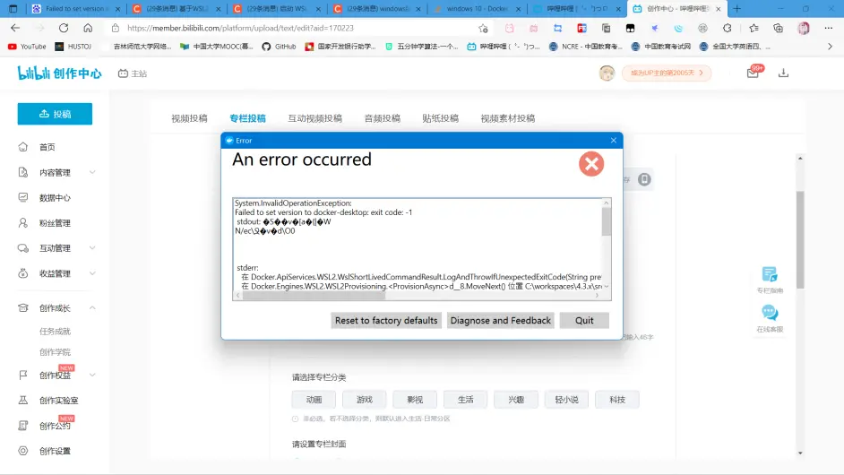

# docker

windows docker 安装

[官网](https://docs.docker.com/desktop/) https://docs.docker.com/desktop/

安装后需要更新 wsl

```shell
wsl -update
```

Docker desktop 安装到指定目录

Docker desktop默认安装到C盘，且安装包无法指定安装目录，这将占用较多的系统盘空间。

解决方案有两种

1.软连接
```shell
cmd /c mklink /J "C:\Program Files\Docker" "E:\Docker\docker"
```
2.安装时加命令参数
```shell
.\DockerInstaller.exe install -accept-license --installation-dir=E:\Docker
```

安装后启动报错


```shell
Description
Every time I open Docker, it states "Docker Desktop is unable to detect a Hypervisor. 
Hardware assisted virtualization and data execution protection must be enabled in the BIOS. See 
https://docs.docker.com/desktop/windows/troubleshoot/#virtualization" 
I've tried everything in the https://docs.docker.com/desktop/troubleshoot/overview/#virtualization has suggested, 
but I'm not sure what else to do. Please help! Diagnostics ID below.
```
解决办法： 只是提交错误报告

在com.docker.diagnose.exe 下  执行 com.docker.diagnose.exe gather -upload
```shell
 C:\Program Files\Docker\Docker\resources\com.docker.diagnose.exe gather -upload
```
得到The diagnostics ID C:\Users\admin\AppData\Local\Temp\01D42D0F-DEA8-4E22-95C1-A6B885ADE096\20230704024844.zip
```shell
Diagnostics Bundle: C:\Users\admin\AppData\Local\Temp\01D42D0F-DEA8-4E22-95C1-A6B885ADE096\20230704023235.zip
```

展开文档
```shell
Expand-Archive -LiteralPath "C:\Users\admin\AppData\Local\Temp\01D42D0F-DEA8-4E22-95C1-A6B885ADE096\20230704024844.zip" 
-DestinationPath "C:\Users\admin\AppData\Local\Temp\01D42D0F-DEA8-4E22-95C1-A6B885ADE096\20230704024844"
```

#### 创建net-work

```shell
docker network create `
  --driver=bridge `
  --subnet=172.18.0.0/16 `
  --ip-range=172.18.0.0/24 `
  --gateway=172.18.0.1 `
  prod
```


记一次 windows11 下 docker启动报错的解决方案

报错：



解决办法：

~~~
netsh winsock reset
~~~

另一种解决方案（测试暂时无效）

~~~
NoLsp.exe c:\windows\system32\wsl.exe
~~~

但是每次重启电脑后 网络都会被重置 导致每次启动docker desktop 都需要执行命令 比较麻烦 故编写了 bat脚本

~~~
::关闭回显
@echo off
echo winsock reset start
::获取管理员执行权限
%1 %2
ver|find "5.">nul&&goto :Admin
mshta vbscript:createobject("shell.application").shellexecute("%~s0","goto :Admin","","runas",1)(window.close)&goto :eof
::管理员权限执行
:Admin
::执行脚本 并关闭cmd窗口
cmd  /c netsh winsock reset
echo winsock reset end
::打开 应用  /mni 以最小化（静默）方式运行程序
start /min "" "C:\Program Files\Docker\Docker\Docker Desktop.exe"
::退出
exit
~~~

[docker.bat](../assets/docker.bat)

## windows无法连接docker容器解决方案

[文献连接](https://github.com/wenjunxiao/mac-docker-connector)

从[Releases](https://github.com/wenjunxiao/mac-docker-connector/releases)下载 desktop-docker-connector然后解压.

Need to install tap driver tap-windows from OpenVPN. Download the latest version https://build.openvpn.net/downloads/releases/tap-windows-9.24.7-I601-Win10.exe and install.

[tap-windows-9.24.7-I601-Win10.exe](../assets/tap-windows-9.24.7-I601-Win10.exe)

执行以下命令安装服务，把所有需要访问的Bridge子网地址按照route 172.17.0.0/16的格式写入options.conf

```shell
$ docker-connector.exe install -config options.conf
```
把所有需要访问的Bridge子网地址按照route 172.17.0.0/16的格式写入options.conf


```shell
route 172.17.0.0/16
```
可以通过脚本start-connector.bat来直接启动连接器，或者把连接器按照以下步骤安装成服务之后启动:

```shell
2023/07/04 23:44:41 config file => E:\data\docker\docker-connector\options.conf
2023/07/04 23:44:41 load config(true) => E:\data\docker\docker-connector\options.conf
2023/07/04 23:44:41 command => netsh interface ip set address "本地连接" static 192.168.251.2 255.255.255.0 192.168.251.1
2023/07/04 23:44:41 command => netsh interface ip show addresses "本地连接"
waiting network setup...
2023/07/04 23:44:42 command => netsh interface ip show addresses "本地连接"
waiting network setup...
2023/07/04 23:44:43 command => netsh interface ip show addresses "本地连接"
waiting network setup...
2023/07/04 23:44:44 command => netsh interface ip show addresses "本地连接"
waiting network setup...
2023/07/04 23:44:45 command => netsh interface ip show addresses "本地连接"
2023/07/04 23:44:45 command => netsh interface ip delete dns "本地连接" all
2023/07/04 23:44:45 command => netsh interface ip delete wins "本地连接" all
2023/07/04 23:44:47 command => route delete 172.18.0.0 mask 255.255.0.0 192.168.251.1
2023/07/04 23:44:47 command => route add 172.18.0.0 mask 255.255.0.0 192.168.251.1
2023/07/04 23:44:47 command => route delete 172.17.0.0 mask 255.255.0.0 192.168.251.1
2023/07/04 23:44:47 command => route add 172.17.0.0 mask 255.255.0.0 192.168.251.1
2023/07/04 23:44:47 listen => 127.0.0.1:2511
2023/07/04 23:44:49 client init => 127.0.0.1:50089
2023/07/04 23:44:49 send controls => 127.0.0.1:50089 map[]
2023/07/04 23:44:49 reply client => 127.0.0.1:50089 0
```

1.运行脚本install-service.bat安装服务.
2.运行脚本start-service.bat来启动服务. 还可以通过运行脚本stop-service.bat停止服务以及运行脚本uninstall-service.bat卸载服务

Docker
Install docker front of desktop-docker-connector
```shell
docker pull wenjunxiao/desktop-docker-connector
```
启动Docker端的容器，其中网络必须是host，并且添加NET_ADMIN特性

```shell
docker run -it -d --restart always --net host --cap-add NET_ADMIN --name desktop-connector wenjunxiao/desktop-docker-connector
```
如果你向导出你自己的容器给其他人，让其他人可以访问你在容器中搭建的服务，其他人必须安装另一个客户端docker-accessor，同时你必须开启expose（这默认是关闭的）和提供访问的令牌(token)， 更详细的配置说明参考配置说明

## docker engine
~~~config
{
  "registry-mirrors": [
    "https://docker.mirrors.ustc.edu.cn/",
    "https://1rlt72n0.mirror.aliyuncs.com",
    "https://registry.docker-cn.com",
    "http://hub-mirror.c.163.com",
    "https://docker.mirrors.ustc.edu.cn",
    "https://reg-mirror.qiniu.com",
    "https://dockerhub.azk8s.cn",
    "https://mirror.ccs.tencentyun.com"
  ],
  "builder": {
    "gc": {
      "defaultKeepStorage": "20GB",
      "enabled": true
    }
  },
  "experimental": false
}
~~~