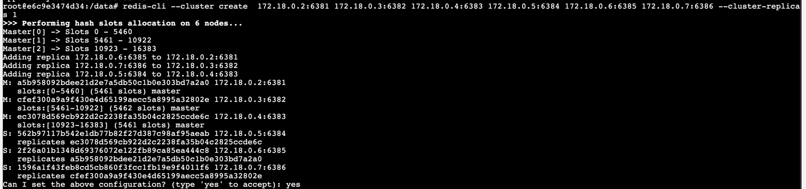
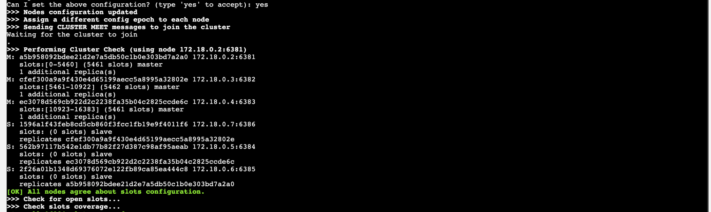
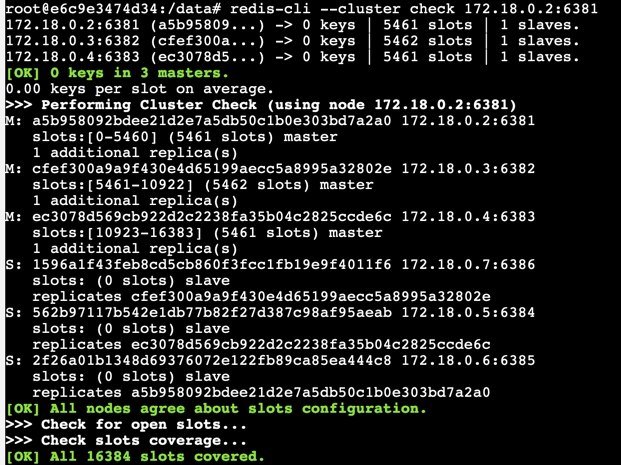
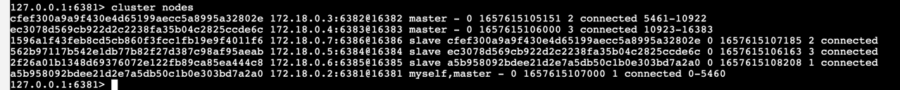
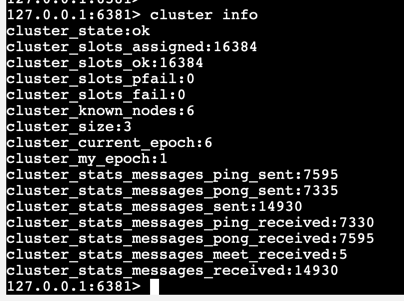
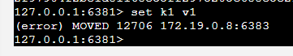
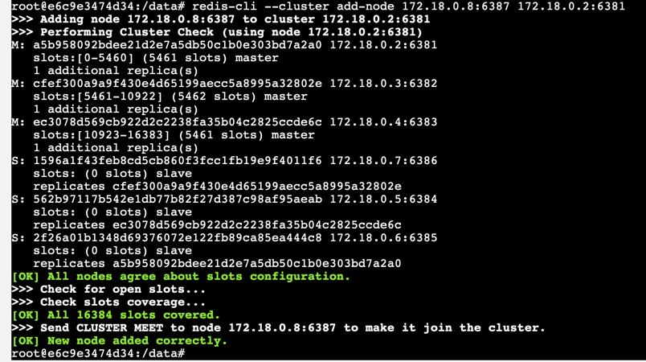
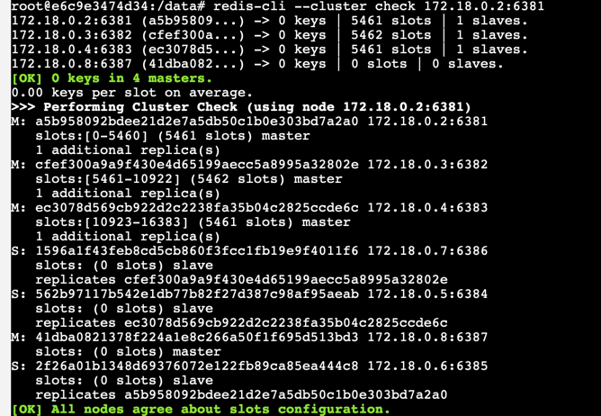
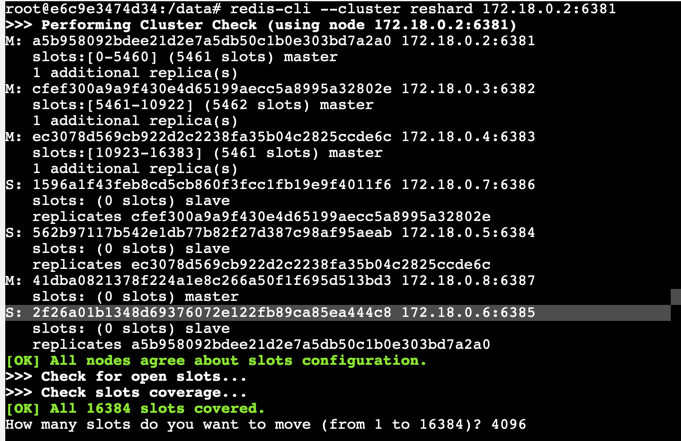

# redis

## redis cluster

```text
for port in $(seq 1 6);
do
mkdir -p ${PWD}/redis/redis-node-${port}/conf
done
```

## 准备工作

准备8台redis

### windows

```shell
docker run -d -p 6381:6381 --name redis-node-1 --net prod-network --privileged=true --hostname redis-node-1  --ip 172.18.0.11 --add-host redis-node-2:172.18.0.12 --add-host redis-node-3:172.18.0.13 --add-host redis-node-4:172.18.0.14 --add-host redis-node-5:172.18.0.15 --add-host redis-node-6:172.18.0.16 --add-host redis-node-7:172.18.0.17 --add-host redis-node-8:172.18.0.18 -v E:\data\apps\redis\redis-node-1:/data redis:6.0.8 --requirepass "123456" --masterauth "123456" --cluster-enabled yes --appendonly yes --port 6381
docker run -d -p 6382:6382 --name redis-node-2 --net prod-network --privileged=true --hostname redis-node-2  --ip 172.18.0.12 --add-host redis-node-1:172.18.0.11 --add-host redis-node-3:172.18.0.13 --add-host redis-node-4:172.18.0.14 --add-host redis-node-5:172.18.0.15 --add-host redis-node-6:172.18.0.16 --add-host redis-node-7:172.18.0.17 --add-host redis-node-8:172.18.0.18 -v E:\data\apps\redis\redis-node-2:/data redis:6.0.8 --requirepass "123456" --masterauth "123456" --cluster-enabled yes --appendonly yes --port 6382
docker run -d -p 6383:6383 --name redis-node-3 --net prod-network --privileged=true --hostname redis-node-3  --ip 172.18.0.13 --add-host redis-node-1:172.18.0.11 --add-host redis-node-2:172.18.0.12 --add-host redis-node-4:172.18.0.14 --add-host redis-node-5:172.18.0.15 --add-host redis-node-6:172.18.0.16 --add-host redis-node-7:172.18.0.17 --add-host redis-node-8:172.18.0.18 -v E:\data\apps\redis\redis-node-3:/data redis:6.0.8 --requirepass "123456" --masterauth "123456" --cluster-enabled yes --appendonly yes --port 6383
docker run -d -p 6384:6384 --name redis-node-4 --net prod-network --privileged=true --hostname redis-node-4  --ip 172.18.0.14 --add-host redis-node-1:172.18.0.11 --add-host redis-node-2:172.18.0.12 --add-host redis-node-3:172.18.0.13 --add-host redis-node-5:172.18.0.15 --add-host redis-node-6:172.18.0.16 --add-host redis-node-7:172.18.0.17 --add-host redis-node-8:172.18.0.18 -v E:\data\apps\redis\redis-node-4:/data redis:6.0.8 --requirepass "123456" --masterauth "123456" --cluster-enabled yes --appendonly yes --port 6384
docker run -d -p 6385:6385 --name redis-node-5 --net prod-network --privileged=true --hostname redis-node-5  --ip 172.18.0.15 --add-host redis-node-1:172.18.0.11 --add-host redis-node-2:172.18.0.12 --add-host redis-node-3:172.18.0.13  --add-host redis-node-4:172.18.0.14 --add-host redis-node-6:172.18.0.16 --add-host redis-node-7:172.18.0.17 --add-host redis-node-8:172.18.0.18 -v E:\data\apps\redis\redis-node-5:/data redis:6.0.8 --requirepass "123456" --masterauth "123456" --cluster-enabled yes --appendonly yes --port 6385
docker run -d -p 6386:6386 --name redis-node-6 --net prod-network --privileged=true --hostname redis-node-6  --ip 172.18.0.16 --add-host redis-node-1:172.18.0.11 --add-host redis-node-2:172.18.0.12 --add-host redis-node-3:172.18.0.13  --add-host redis-node-4:172.18.0.14 --add-host redis-node-5:172.18.0.15 --add-host redis-node-6:172.18.0.16 --add-host redis-node-8:172.18.0.18 -v E:\data\apps\redis\redis-node-6:/data redis:6.0.8 --requirepass "123456" --masterauth "123456" --cluster-enabled yes --appendonly yes --port 6386
#单节点
docker run -d -p 6379:6379 --name redis-node --net prod-network --privileged=true --hostname redis-node  --ip 172.18.0.10 --add-host redis-node-1:172.18.0.11 --add-host redis-node-2:172.18.0.12 --add-host redis-node-3:172.18.0.13 --add-host redis-node-4:172.18.0.14 --add-host redis-node-5:172.18.0.15 --add-host redis-node-6:172.18.0.16 --add-host redis-node-8:172.18.0.18 -v E:\data\apps\redis\redis-node:/data redis:6.0.8 --requirepass "123456" --appendonly yes --port 6379
```


此处配置暂不使用
windows 中 ping不通docker容器内ip 固选择host模式  mac可以选择使用ip桥接模式
```shell
docker run -d --name redis-node-1 --net host --privileged=true --hostname redis-node-1  -v E:\data\apps\redis\redis-node-1:/data redis:6.0.8 --requirepass "123456" --masterauth "123456" --cluster-enabled yes --appendonly yes --port 6381
docker run -d --name redis-node-2 --net host --privileged=true --hostname redis-node-2  -v E:\data\apps\redis\redis-node-2:/data redis:6.0.8 --requirepass "123456" --masterauth "123456" --cluster-enabled yes --appendonly yes --port 6382
docker run -d --name redis-node-3 --net host --privileged=true --hostname redis-node-3  -v E:\data\apps\redis\redis-node-3:/data redis:6.0.8 --requirepass "123456" --masterauth "123456" --cluster-enabled yes --appendonly yes --port 6383
docker run -d --name redis-node-4 --net host --privileged=true --hostname redis-node-4  -v E:\data\apps\redis\redis-node-4:/data redis:6.0.8 --requirepass "123456" --masterauth "123456" --cluster-enabled yes --appendonly yes --port 6384
docker run -d --name redis-node-5 --net host --privileged=true --hostname redis-node-5  -v E:\data\apps\redis\redis-node-5:/data redis:6.0.8 --requirepass "123456" --masterauth "123456" --cluster-enabled yes --appendonly yes --port 6385
docker run -d --name redis-node-6 --net host --privileged=true --hostname redis-node-6  -v E:\data\apps\redis\redis-node-6:/data redis:6.0.8 --requirepass "123456" --masterauth "123456" --cluster-enabled yes --appendonly yes --port 6386
#单节点
docker run -d --name redis-node --net host --privileged=true --hostname redis-node -v E:\data\apps\redis\redis-node:/data redis:6.0.8  --appendonly yes --port 6379
```
此处配置暂不使用

### mac

```shell
docker run -d --name redis-node-1 --net prod-network --privileged=true \
--hostname redis-node-1  --ip 172.18.0.11 --add-host redis-node-2:172.18.0.12 --add-host redis-node-3:172.18.0.13 --add-host redis-node-4:172.18.0.14 --add-host redis-node-5:172.18.0.15 --add-host redis-node-6:172.18.0.16 --add-host redis-node-7:172.18.0.17 --add-host redis-node-8:172.18.0.18 \
-v /Users/xxx/data/apps/redis/redis-node-1:/data \
redis:6.0.8 --requirepass "123456" --masterauth "123456" --cluster-enabled yes --appendonly yes --port 6381

docker run -d --name redis-node-2 --net prod-network --privileged=true \
--hostname redis-node-2  --ip 172.18.0.12 --add-host redis-node-1:172.18.0.11 --add-host redis-node-3:172.18.0.13 --add-host redis-node-4:172.18.0.14 --add-host redis-node-5:172.18.0.15 --add-host redis-node-6:172.18.0.16 --add-host redis-node-7:172.18.0.17 --add-host redis-node-8:172.18.0.18 \
-v /Users/xxx/data/apps/redis/redis-node-2:/data redis:6.0.8 --requirepass "123456" --masterauth "123456" --cluster-enabled yes --appendonly yes --port 6382

docker run -d --name redis-node-3 --net prod-network --privileged=true \
--hostname redis-node-3  --ip 172.18.0.13 --add-host redis-node-1:172.18.0.11 --add-host redis-node-2:172.18.0.12  --add-host redis-node-4:172.18.0.14 --add-host redis-node-5:172.18.0.15 --add-host redis-node-6:172.18.0.16 --add-host redis-node-7:172.18.0.17 --add-host redis-node-8:172.18.0.18 \
-v /Users/xxx/data/apps/redis/redis-node-3:/data redis:6.0.8 --requirepass "123456" --masterauth "123456" --cluster-enabled yes --appendonly yes --port 6383

docker run -d --name redis-node-4 --net prod-network --privileged=true \
--hostname redis-node-4  --ip 172.18.0.14 --add-host redis-node-1:172.18.0.11 --add-host redis-node-2:172.18.0.12 --add-host redis-node-3:172.18.0.13  --add-host redis-node-5:172.18.0.15 --add-host redis-node-6:172.18.0.16 --add-host redis-node-7:172.18.0.17 --add-host redis-node-8:172.18.0.18 \
-v /Users/xxx/data/apps/redis/redis-node-4:/data redis:6.0.8 --requirepass "123456" --masterauth "123456" --cluster-enabled yes --appendonly yes --port 6384

docker run -d --name redis-node-5 --net prod-network --privileged=true \
--hostname redis-node-5  --ip 172.18.0.15 --add-host redis-node-1:172.18.0.11 --add-host redis-node-2:172.18.0.12 --add-host redis-node-3:172.18.0.13  --add-host redis-node-4:172.18.0.14 --add-host redis-node-6:172.18.0.16 --add-host redis-node-7:172.18.0.17 --add-host redis-node-8:172.18.0.18 \
-v /Users/xxx/data/apps/redis/redis-node-5:/data redis:6.0.8 --requirepass "123456" --masterauth "123456" --cluster-enabled yes --appendonly yes --port 6385

docker run -d --name redis-node-6 --net prod-network --privileged=true \
--hostname redis-node-6  --ip 172.18.0.16 --add-host redis-node-1:172.18.0.11 --add-host redis-node-2:172.18.0.12 --add-host redis-node-3:172.18.0.13  --add-host redis-node-4:172.18.0.14 --add-host redis-node-5:172.18.0.15 --add-host redis-node-6:172.18.0.16 --add-host redis-node-8:172.18.0.18 \
-v /Users/xxx/data/apps/redis/redis-node-6:/data redis:6.0.8 --requirepass "123456" --masterauth "123456" --cluster-enabled yes --appendonly yes --port 6386

docker run -d --name redis-node-7 --net prod-network --privileged=true \
--hostname redis-node-7  --ip 172.18.0.17 --add-host redis-node-1:172.18.0.11 --add-host redis-node-2:172.18.0.12 --add-host redis-node-3:172.18.0.13 --add-host redis-node-4:172.18.0.14 --add-host redis-node-5:172.18.0.15 --add-host redis-node-6:172.18.0.16 --add-host redis-node-8:172.18.0.18 \
-v /Users/xxx/data/apps/redis/redis-node-7:/data redis:6.0.8 --requirepass "123456" --masterauth "123456" --cluster-enabled yes --appendonly yes --port 6387

docker run -d --name redis-node-8 --net prod-network --privileged=true \
--hostname redis-node-8  --ip 172.18.0.18 --add-host redis-node-1:172.18.0.11 --add-host redis-node-2:172.18.0.12 --add-host redis-node-3:172.18.0.13 --add-host redis-node-4:172.18.0.14 --add-host redis-node-5:172.18.0.15 --add-host redis-node-6:172.18.0.16 --add-host redis-node-7:172.18.0.17 \
-v /Users/xxx/data/apps/redis/redis-node-8:/data redis:6.0.8 --requirepass "123456" --masterauth "123456" --cluster-enabled yes --appendonly yes --port 6388

#单节点
docker run -d -p 6379:6379 --name redis-node --net prod-network --privileged=true --hostname redis-node  --ip 172.18.0.10 --add-host redis-node-1:172.18.0.11 --add-host redis-node-2:172.18.0.12 --add-host redis-node-3:172.18.0.13 --add-host redis-node-4:172.18.0.14 --add-host redis-node-5:172.18.0.15 --add-host redis-node-6:172.18.0.16 --add-host redis-node-8:172.18.0.18 -v /Users/zhangbao/data/apps/redis/redis-node:/data redis:6.0.8 --requirepass "123456" --appendonly yes --port 6379
```

### 创建redis集群

```
redis-cli --cluster create 172.18.0.11:6381 172.18.0.12:6382 172.18.0.13:6383 172.18.0.14:6384 172.18.0.15:6385 172.18.0.16:6386 --cluster-replicas 1
# 必须为ip地址  redis集群对主机名不敏感  配置会失败
# --cluster-replicas 1  主从节点比例
```

`
提示是否看到上面的配置  输入 yes

3主3从已经创建好了

### 检查

```
redis-cli --cluster check 172.18.0.11:6381
```



### 连接进redis查询

```
cluster nodes
cluster info
```




### set key


报错 因为k1的slot值为12706不在当前节点

```
127.0.0.1:6381> cluster keyslot k1
(integer) 12706
```

解决办法

加入 -c参数
优化路由

```shell
root@c7f826a0e9ea:/data# redis-cli -p 6381 -c
127.0.0.1:6381> set k1 v1
-> Redirected to slot [12706] located at 172.18.0.8:6383
OK
```

### 增加节点

加入新的主节点

```shell
redis-cli --cluster add-node 172.18.0.8:6387 172.18.0.2:6381
```


再次check 发现新的主节点中没有slot

重新分配hash槽

```shell
redis-cli --cluster reshard 172.18.0.2:6381
```


设置hash槽数为 16384 % nodes

```shell
How many slots do you want to move (from 1 to 16384)? 4096
What is the receiving node ID? 41dba0821378f224a1e8c266a50f1f695d513bd3
Please enter all the source node IDs.
  Type 'all' to use all the nodes as source nodes for the hash slots.
  Type 'done' once you entered all the source nodes IDs.
Source node #1: all
```

```shell
#命令：redis-cli --cluster add-node ip:新slave端口 ip:新master端口 --cluster-slave --cluster-master-id 新主机节点ID

redis-cli --cluster add-node 172.18.0.18:6388 172.18.0.17:6387 --cluster-slave --cluster-master-id 41dba0821378f224a1e8c266a50f1f695d513bd3
```

再次检查

```shell
redis-cli --cluster check 172.18.0.12:6382
172.18.0.12:6382 (cfef300a...) -> 0 keys | 6144 slots | 1 slaves.
172.18.0.11:6381 (a5b95809...) -> 0 keys | 3072 slots | 1 slaves.
172.18.0.13:6383 (ec3078d5...) -> 0 keys | 3072 slots | 1 slaves.
172.18.0.17:6387 (41dba082...) -> 0 keys | 4096 slots | 1 slaves.
[OK] 0 keys in 4 masters.
0.00 keys per slot on average.
```

平滑扩容结束

### 删除节点

先删除从机

```shell
#命令：redis-cli --cluster del-node ip:从机端口 从机6388节点ID
redis-cli --cluster del-node 172.18.0.5:6388 9e2727da166815c545f9c9dede4958f214306f37
```

```shell
root@c7f826a0e9ea:/data# redis-cli --cluster del-node 172.18.0.5:6388 9e2727da166815c545f9c9dede4958f214306f37
>>> Removing node 9e2727da166815c545f9c9dede4958f214306f37 from cluster 172.18.0.5:6388
>>> Sending CLUSTER FORGET messages to the cluster...
>>> Sending CLUSTER RESET SOFT to the deleted node.
```

删除成功
再次检查  从机已经下线

```shell
redis-cli --cluster reshard 172.18.0.2:6381
```

```shell
#想要移除的slot数
How many slots do you want to move (from 1 to 16384)? 4096
#谁来接收slot
What is the receiving node ID? 61dadb193c41bc66c80a208237ca9fadaef3de17
Please enter all the source node IDs.
  Type 'all' to use all the nodes as source nodes for the hash slots.
  Type 'done' once you entered all the source nodes IDs.
#源节点 提供slot
Source node #1: 332caaa837f440becb6d3ef533a4408f0c02a002
Source node #2: done
```

```shell
root@c7f826a0e9ea:/data# redis-cli --cluster check 172.18.0.2:6381
172.18.0.2:6381 (61dadb19...) -> 0 keys | 8192 slots | 1 slaves.
172.18.0.8:6383 (c6a9f52a...) -> 1 keys | 4096 slots | 1 slaves.
#已经可以看到  该主节点没有slot
172.18.0.4:6387 (332caaa8...) -> 0 keys | 0 slots | 0 slaves.
172.18.0.18:6382 (d810e8e6...) -> 0 keys | 4096 slots | 1 slaves.
[OK] 1 keys in 4 masters.
0.00 keys per slot on average.
>>> Performing Cluster Check (using node 172.18.0.2:6381)
M: 61dadb193c41bc66c80a208237ca9fadaef3de17 172.18.0.2:6381
   slots:[0-6826],[10923-12287] (8192 slots) master
   1 additional replica(s)
M: c6a9f52a5c63b145699d3357aedc7a07d83c4a42 172.18.0.8:6383
   slots:[12288-16383] (4096 slots) master
   1 additional replica(s)
S: 3be36667ed5ac16ba5225b26ed625f48fca2b091 172.18.0.7:6386
   slots: (0 slots) slave
   replicates d810e8e610e04a2bb82360b816c22252efc90463
M: 332caaa837f440becb6d3ef533a4408f0c02a002 172.18.0.4:6387
   slots: (0 slots) master
S: 4a3789c00b85a8ae32b87ee1115ceaef554835eb 172.18.0.3:6385
   slots: (0 slots) slave
   replicates 61dadb193c41bc66c80a208237ca9fadaef3de17
M: d810e8e610e04a2bb82360b816c22252efc90463 172.18.0.18:6382
   slots:[6827-10922] (4096 slots) master
   1 additional replica(s)
S: 2f97904f2be1d81168e35ff2975205c688e5e215 172.18.0.6:6384
   slots: (0 slots) slave
   replicates c6a9f52a5c63b145699d3357aedc7a07d83c4a42
[OK] All nodes agree about slo
```

最后删除主节点

```shell
root@c7f826a0e9ea:/data# redis-cli --cluster del-node 172.18.0.4:6387 332caaa837f440becb6d3ef533a4408f0c02a002
>>> Removing node 332caaa837f440becb6d3ef533a4408f0c02a002 from cluster 172.18.0.4:6387
>>> Sending CLUSTER FORGET messages to the cluster...
>>> Sending CLUSTER RESET SOFT to the deleted node.
```

平滑缩容结束

### Cluster操作命令

```team
CLUSTER INFO 打印集群的信息
CLUSTER NODES 列出集群当前已知的所有节点（node），以及这些节点的相关信息。 
//节点
CLUSTER MEET <ip> <port> 将 ip 和 port 所指定的节点添加到集群当中，让它成为集群的一份子。
CLUSTER FORGET <node_id> 从集群中移除 node_id 指定的节点。
CLUSTER REPLICATE <node_id> 将当前节点设置为 node_id 指定的节点的从节点。
CLUSTER SAVECONFIG 将节点的配置文件保存到硬盘里面。
CLUSTER ADDSLOTS <slot> [slot ...] 将一个或多个槽（slot）指派（assign）给当前节点。
CLUSTER DELSLOTS <slot> [slot ...] 移除一个或多个槽对当前节点的指派。
CLUSTER FLUSHSLOTS 移除指派给当前节点的所有槽，让当前节点变成一个没有指派任何槽的节点。
CLUSTER SETSLOT <slot> NODE <node_id> 将槽 slot 指派给 node_id 指定的节点。
CLUSTER SETSLOT <slot> MIGRATING <node_id> 将本节点的槽 slot 迁移到 node_id 指定的节点中。
CLUSTER SETSLOT <slot> IMPORTING <node_id> 从 node_id 指定的节点中导入槽 slot 到本节点。
CLUSTER SETSLOT <slot> STABLE 取消对槽 slot 的导入（import）或者迁移（migrate）。 
//键
CLUSTER KEYSLOT <key> 计算键 key 应该被放置在哪个槽上。
CLUSTER COUNTKEYSINSLOT <slot> 返回槽 slot 目前包含的键值对数量。
CLUSTER GETKEYSINSLOT <slot> <count> 返回 count 个 slot 槽中的键。 
//新增
CLUSTER SLAVES node-id 返回一个master节点的slaves 列表
```

### shell脚本

```shell
for port in $(seq 6380 6385); 
do 
mkdir -p ${PWD}/redis/node-${port}/conf
touch ${PWD}/redis/node-${port}/conf/redis.conf
cat  << EOF > ${PWD}/redis/node-${port}/conf/redis.conf
port ${port}
requirepass 1234
bind 0.0.0.0
protected-mode no
daemonize no
appendonly yes
cluster-enabled yes 
cluster-config-file nodes.conf
cluster-node-timeout 5000
#服务器ip地址
cluster-announce-ip  10.237.2.44
cluster-announce-port ${port}
cluster-announce-bus-port 1${port}
EOF
done
```

> https://wenku.baidu.com/view/e8b0a5e06237ee06eff9aef8941ea76e58fa4ab4.html

