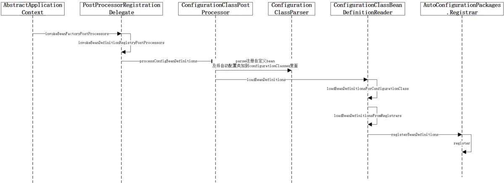

# springboot-stater

> Springboot的出现极大的简化了开发人员的配置，而这之中的一大利器便是springboot的starter，starter是springboot的核心组成部分，springboot官方同时也为开发人员封装了各种各样方便好用的starter模块，例如：
>
> 1.spring-boot-starter-web//spring MVC相关
>
> 2.spring-boot-starter-aop //切面编程相关
>
> 3.spring-boot-starter-cache //缓存相关

## SpringBoot的好处

1. 依赖管理：可插拔式的组件管理，当需要某个组件时，只需要引入相关stater即可，不需要再手动引入各个jar包，避免了包遗漏、包冲突等不必要的问题。开发人员可以专注于业务开发,
2. 自动配置：遵从"约定优于配置"的原则，开发人员可以在少量配置或者不配置的情况下，使用某组件。

   大大降低项目搭建及组件引入的成本，开发人员可以专注于业务开发，避免繁杂的配置和大量的jar包管理。

## 实现原理 - 自动装配

要引入某组件，无非要做两件事。一是引入jar包即pom文件引入stater；二就是编写配置文件，使用Java配置的情况下就是编写一系列@Configuration注解标注的类。那么SpringBoot是怎么来引入这些配置类的呢？

SpringBoot启动类上面会有@SpringBootApplication注解，这是SpringBoot中最重要的一个注解，是实现自动配置的关键。
@SpringBootApplication是一个租合注解，主要由@SpringBootConfiguration、@EnableAutoConfiguration、@ComponentScan三部分组成。

```
@SpringBootApplication
/**
*@See org.springframework.boot.autoconfigure.SpringBootApplication
*/
#源码
@Target({ElementType.TYPE})
@Retention(RetentionPolicy.RUNTIME)
@Documented
@Inherited
@SpringBootConfiguration
@EnableAutoConfiguration
@ComponentScan(
  excludeFilters = {@Filter(
  type = FilterType.CUSTOM,
  classes = {TypeExcludeFilter.class}
), @Filter(
  type = FilterType.CUSTOM,
  classes = {AutoConfigurationExcludeFilter.class}
)}
)
public @interface SpringBootApplication {}
```

@SpringBootConfiguration表明该类是一个配置类。

@EnableAutoConfiguration由@AutoConfigurationPackage和@Import(AutoConfigurationImportSelector.class)组成。

@AutoConfigurationPackage由@Import(AutoconfigurationPackages.Registrar.class)组成，向Bean容器中注册一个AutoConfigurationPackages类，该类持有basePackage，目前我发现的作用是在MyBatis扫描注册Mapper时作为包扫描路径。

@AutoConfigurationPackage的执行流程如下图：


> 这个注解的作用说白了就是将主配置类（@SpringBootApplication标注的类）所在包以及子包里面的所有组件扫描并加载到spring的容器中，这也就是为什么我们在利用springboot进行开发的时候，无论是Controller还是Service的路径都是与主配置类同级或者次级的原因

@Import(AutoConfigurationImportSelector.class)是启动自动配置的核心。
执行流程如下：
执行流程.png)

> 上一个注解我们把所有组件都加载到了容器里面，这个注解就是将需要自动装配的类以全类名的方式返回，那是怎么找到哪些是需要自动装配的类呢？
> 1、AutoConfigurationImportSelector这个类里面有一个方法selectImports()，如下
```
public String[] selectImports(AnnotationMetadata annotationMetadata) {
    if (!this.isEnabled(annotationMetadata)) {
        return NO_IMPORTS;
    } else {
        AutoConfigurationEntry autoConfigurationEntry = this.getAutoConfigurationEntry(annotationMetadata);
        return StringUtils.toStringArray(autoConfigurationEntry.getConfigurations());
    }
}
```
> 2、在selectImport()方法里调用了一个getAutoConfigurationEntry()方法，这个方法里面又调用了一个getCandidateConfigurations()方法

```
  protected AutoConfigurationEntry getAutoConfigurationEntry(AnnotationMetadata annotationMetadata) {
    if (!this.isEnabled(annotationMetadata)) {
      return EMPTY_ENTRY;
    } else {
      AnnotationAttributes attributes = this.getAttributes(annotationMetadata);
      List<String> configurations = this.getCandidateConfigurations(annotationMetadata, attributes);
      configurations = this.removeDuplicates(configurations);
      Set<String> exclusions = this.getExclusions(annotationMetadata, attributes);
      this.checkExcludedClasses(configurations, exclusions);
      configurations.removeAll(exclusions);
      configurations = this.getConfigurationClassFilter().filter(configurations);
      this.fireAutoConfigurationImportEvents(configurations, exclusions);
      return new AutoConfigurationEntry(configurations, exclusions);
    }
  }
```
> 3、在getCandidateConfigurations()方法里面调用了loadFactoryNames()方法

```
  public static List<String> loadFactoryNames(Class<?> factoryType, @Nullable ClassLoader classLoader) {
    ClassLoader classLoaderToUse = classLoader;
    if (classLoader == null) {
      classLoaderToUse = SpringFactoriesLoader.class.getClassLoader();
    }

    String factoryTypeName = factoryType.getName();
    return (List)loadSpringFactories(classLoaderToUse).getOrDefault(factoryTypeName, Collections.emptyList());
  }
```
> 4、loadFactoryNames()方法里面又调用了一个loadSpringFactories()方法
> 5、关键就在这个loadSpringFactories()方法里面，在这个方法里，它会查找所有在META-INF路径下的spring.factories文件
> 6、在META-INF/spring.factories这个文件里面的数据是以键=值的方式存储，然后解析这些文件，找出以EnableAutoConfiguration为键的所有值，以列表的方式返回

```
  private static Map<String, List<String>> loadSpringFactories(ClassLoader classLoader) {
    Map<String, List<String>> result = (Map)cache.get(classLoader);
    if (result != null) {
      return result;
    } else {
      Map<String, List<String>> result = new HashMap();

      try {
        Enumeration<URL> urls = classLoader.getResources("META-INF/spring.factories");

        while(urls.hasMoreElements()) {
          URL url = (URL)urls.nextElement();
          UrlResource resource = new UrlResource(url);
          Properties properties = PropertiesLoaderUtils.loadProperties(resource);
          Iterator var6 = properties.entrySet().iterator();

          while(var6.hasNext()) {
            Map.Entry<?, ?> entry = (Map.Entry)var6.next();
            String factoryTypeName = ((String)entry.getKey()).trim();
            String[] factoryImplementationNames = StringUtils.commaDelimitedListToStringArray((String)entry.getValue());
            String[] var10 = factoryImplementationNames;
            int var11 = factoryImplementationNames.length;

            for(int var12 = 0; var12 < var11; ++var12) {
              String factoryImplementationName = var10[var12];
              ((List)result.computeIfAbsent(factoryTypeName, (key) -> {
                return new ArrayList();
              })).add(factoryImplementationName.trim());
            }
          }
        }

        result.replaceAll((factoryType, implementations) -> {
          return (List)implementations.stream().distinct().collect(Collectors.collectingAndThen(Collectors.toList(), Collections::unmodifiableList));
        });
        cache.put(classLoader, result);
        return result;
      } catch (IOException var14) {
        throw new IllegalArgumentException("Unable to load factories from location [META-INF/spring.factories]", var14);
      }
    }
  }
```

## 自定义的Starter

> 官网要求创建两个module ，一个是autoconfigure module 一个是 starter module ，其中 starter module 依赖 autoconfigure module，主要起到一个传递依赖的作用

## 命名规范：

> 官方推出的starter 以spring-boot-starter-xxx的格式来命名，第三方开发者自定义的starter则以xxxx-spring-boot-starter的规则来命名。

1. pom配置

```
<dependencies>
    <!--启动器的基本依赖-->
    <dependency>
       <groupId>org.springframework.boot</groupId>
       <artifactId>spring-boot-starter</artifactId>
    </dependency>
    <!-- 配置文件时进行提示-->
    <dependency>
        <groupId>org.springframework.boot</groupId>
        <artifactId>spring-boot-configuration-processor</artifactId>
        <optional>true</optional>
    </dependency>
</dependencies>
```

2. 编写配置

```
@Data
@ConfigurationProperties(prefix = "collection.starter.static")
public class CollectionProperties {

  private String id;

  private String name;
}
```

> @ConfigurationProperties:该配置类和SpringBoot中的application.properties/application.yml配置文件相关联从而进行属性注入。

3. 编写服务

```
@Data
public class CollectionService {

  private CollectionProperties collectionProperties;

  public String biz(){
    return collectionProperties.toString();
  }

}
```

4. 自动配置

```
@Slf4j
@Configuration
@ConditionalOnWebApplication
@EnableConfigurationProperties(CollectionProperties.class)
@ConditionalOnProperty(prefix = "collection.starter.static", name = "enabled", havingValue = "true", matchIfMissing = true)
public class CollectionAutoConfiguration {

  @Resource
  CollectionProperties collectionProperties;

  @Bean
  public CollectionService getHelloService(){
    log.info("collection-stater init start");
    CollectionService service = new CollectionService();
    service.setCollectionProperties(collectionProperties);
    log.info("collection-stater init end");
    return service;
  }

}
```

- @ConditionalOnXXXX：用来判断某些条件是否满足，以此来决定该自动配置是否生效
- @Bean：将服务和配置类整合起来，配置成组件，注入到容器中，供用户调用
- @EnableConfigurationProperties ：让xxxProperties生效并加入到容器中
- @ConditionalOnProperty @ConditionalOnProperty控制配置类是否生效,可以将配置与代码进行分离,实现了更好的控制配置.
  @ConditionalOnProperty实现是通过havingValue与配置文件中的值对比,返回为true则配置类生效,反之失效.

```
@Retention(RetentionPolicy.RUNTIME)
@Target({ ElementType.TYPE, ElementType.METHOD })
@Documented
@Conditional(OnPropertyCondition.class)
public @interface ConditionalOnProperty {
    // 数组，获取对应property名称的值，与name不可同时使用
    String[] value() default {};

    // 配置属性名称的前缀，比如spring.http.encoding
    String prefix() default "";

    // 数组，配置属性完整名称或部分名称
    // 可与prefix组合使用，组成完整的配置属性名称，与value不可同时使用
    String[] name() default {};

    // 可与name组合使用，比较获取到的属性值与havingValue给定的值是否相同，相同才加载配置
    String havingValue() default "";

    // 缺少该配置属性时是否可以加载。如果为true，没有该配置属性时也会正常加载；反之则不会生效
    boolean matchIfMissing() default false;
}
```

5. spring.factories

编写一个META-INF文件，在项目启动扫描包时，会自动加载spring.factories文件下指定的配置类

```
# Auto Configure
org.springframework.boot.autoconfigure.EnableAutoConfiguration=com.myself.project.starter.config.CollectionAutoConfiguration
```
