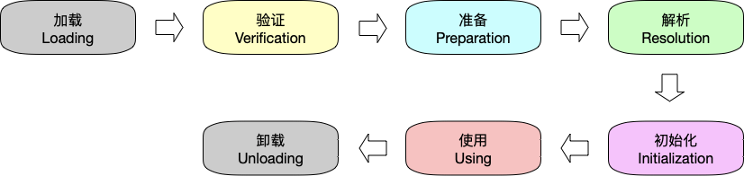
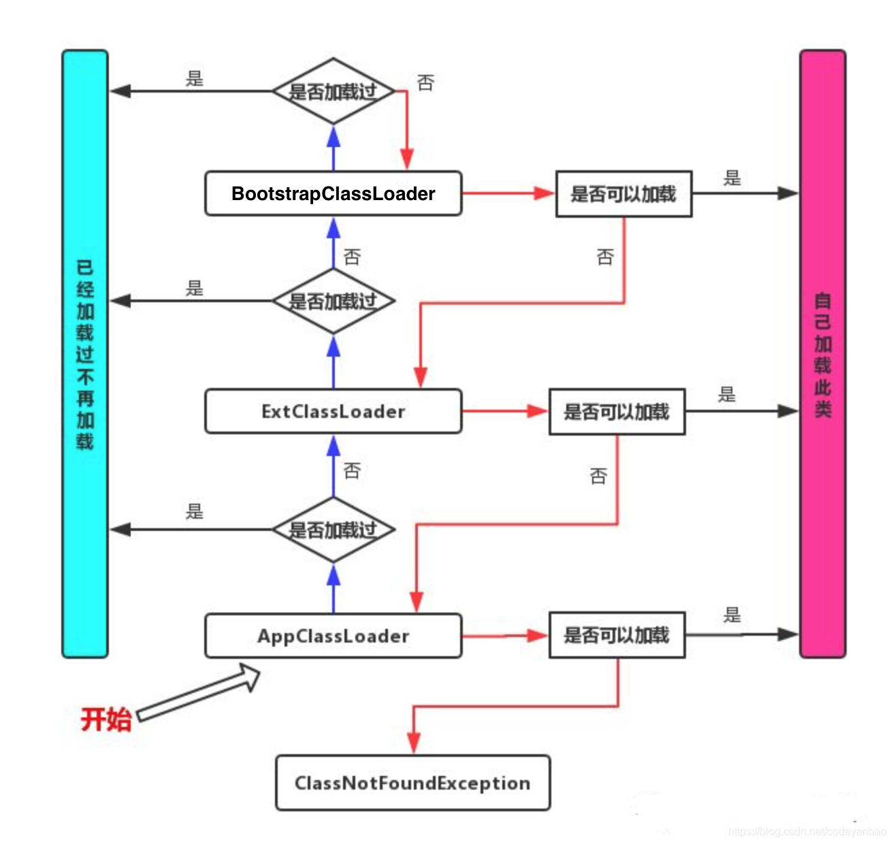
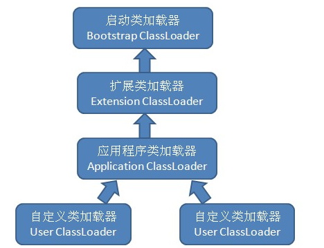
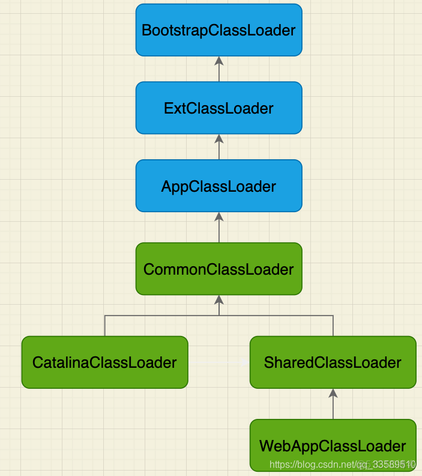

# Java

## 面向对象的三大特性

封装、继承、多态

### 封装

就是把类的属性私有化(private修饰），再通过公有方法(public)进行访问和修改

```
1.封装：是指隐藏对象的属性和实现细节，仅对外提供公共访问方式。
2.优点：
        • 将变化隔离
        • 便于使用
        • 提高重用性
        • 提高安全性
3. 封装原则：
        • 将不需要对外提供的内容都隐藏起来。
        • 把属性都隐藏，提供公共方法对其访问（set()/get()）
```

### 继承

如果子类继承了父类，那么子类就可以复用父类的方法和属性，并且可以在此基础上新增方法和属性

```
1. 继承:从已有的类中派生出新的类， 新的类能拥有已有类的数据属性和行为，并能扩展新的能力。
在JAVA中， 被继承的类叫父类(parent class)或超类(superclass)， 继承父类的类叫子类(subclass)或派生类(derivedclass)。 因此， 子类是父类的一个专门用途的版本， 它继承了父类中定义的所有实例变量和方法， 并且增加了独特的元素 。
   继承的使用 ：
			• 关键字：extends
2.优点：
	 		• 提高代码复用性
    		• 父类的属性方法可以用于子类
    		• 可以轻松的定义子类
     		• 使设计应用程序变得简单

3.特点:
        •单继承
        • 子类可以拥有父类的属性和方法
        • 子类可以拥有自己的属性和方法
        • 子类可以重写覆盖父类的方法
```

### 多态

就是多种形态，在Java中，多态指的是，一个类可以有多种表现形态
继承属于多态
接口类一种是比抽象类更加抽象的类

```
1.多态：在面向对象语言中， 多态性是指一个方法可以有多种实现版本，即“一种定义， 多种实现”。 利用多态可以设计和实现可扩展的系统， 只要新类也在继承层次中。 新的类对程序的通用部分只需进行很少的修改， 或不做修改。 *类的多态性表现为方法的多态性，方法的多态性主要有方法的重载和方法的覆盖。*

2.优点：
        • 可替换性：多态对已存在代码具有可替换性。
        • 可扩充性：多态对代码具有可扩充性。增加新的子类不影响已存在类的多态性、继承性，以及其他特性的运行和操作。
        •  接口性：多态是超类通过方法签名，向子类提供了一个共同接口，由子类来完善或者覆盖它而实现的。
        • 灵活性：它在应用中体现了灵活多样的操作，提高了使用效率。 
        • 简化性：多态简化对应用软件的代码编写和修改过程，尤其在处理大量对象的运算和操作时，这个特点尤为突出和重要。
        
3. 体现：
       •多态的定义与使用格式
                      定义格式：父类类型 变量名=new 子类类型();
       •多态成员变量：编译运行看左边
                     Fu f=new Zi();
                     System.out.println(f.num);//f是Fu中的值，只能取到父中的值
       •多态成员方法：编译看左边，运行看右边
                    Fu f1=new Zi();
                    System.out.println(f1.show());//f1的门面类型是Fu,但实际类型是Zi,所以调用的是重写后的方法。
4.判断是否是父类
        •Instanceof 关键字 ：
        •instanceof关键字是用来判断其左边对象是否为其右边的实例， 返回boolean类型的数据 .
```

### 访问权限修饰符

|/|private |friendly（默认）| protected |public|
|:---:|:---|:---:|---:|---:|
|当前类访问权限 |√| √ |√ |√| 
|包访问权限 |×| √| √| √| 
|子类访问权限 |× |× |√| √| 
|其他类访问权限 |×| ×| × |√|


## HashCode的作用

```
1、hashCode的存在主要是用于查找的快捷性，如Hashtable，HashMap等，hashCode是用来在散列存储结构中确定对象的存储地址的；
2、如果两个对象相同，就是适用于equals(java.lang.Object) 方法，那么这两个对象的hashCode一定要相同；
3、如果对象的equals方法被重写，那么对象的hashCode也尽量重写，并且产生hashCode使用的对象，一定要和equals方法中使用的一致，否则就会违反上面提到的第2点；
4、两个对象的hashCode相同，并不一定表示两个对象就相同，也就是不一定适用于equals(java.lang.Object) 方法，只能够说明这两个对象在散列存储结构中，如Hashtable，他们“存放在同一个篮子里”。
```

## Java类加载的过程



## JVM中提供了三层的[ClassLoader](https://so.csdn.net/so/search?q=ClassLoader&spm=1001.2101.3001.7020)

Bootstrap classLoader:主要负责加载核心的类库(java.lang.*等)，构造ExtClassLoader和APPClassLoader。

ExtClassLoader：主要负责加载jre/lib/ext目录下的一些扩展的jar。

AppClassLoader：主要负责加载应用程序的主函数类

### 双亲委派加载原理



## JDK的双亲委派模型



## 怎么打破类加载机制

1. 继承ClassLoader，并重写loadClass
2. 使用Thread的contextClassLoader
例如JDBC的Driver就是使用JDK的SPI
3. 热部署

### 打破双亲委派模型的历史

1. 第一次破坏

由于双亲委派模型是在JDK1.2之后才被引入的，而类加载器和抽象类java.lang.ClassLoader则在JDK1.0时代就已经存在，面对已经存在的用户自定义类加载器的实现代码，Java设计者引入双亲委派模型时不得不做出一些妥协。
在此之前，用户去继承java.lang.ClassLoader的唯一目的就是为了重写loadClass()方法，这是因为虚拟机在进行类加载的时候会调用加载器的私有方法loadClassInternal()，而这个方法唯一逻辑就是去调用自己的loadClass()。
用户重写了loadClass才能实现自己的类加载逻辑。

2. 第二次破坏
双亲委派模型的第二次“被破坏”是由这个模型自身的缺陷所导致的，双亲委派很好地解决了各个类加载器的基础类的同一问题：越基础的类由越上层的加载器进行加载
基础类之所以称为“基础”，是因为它们总是作为被用户代码调用的API，但世事往往没有绝对的完美。
如果基础类又要调用回用户的代码，那该么办？
一个典型的例子就是JNDI服务，JNDI现在已经是Java的标准服务，它的代码由启动类加载器去加载（在JDK1.3时放进去的rt.jar），但JNDI的目的就是对资源进行集中管理和查找，它需要调用由独立厂商实现并部署在应用程序的ClassPath下的JNDI接口提供者的代码，但启动类加载器不可能“认识”这些代码。
为了解决这个问题，Java设计团队只好引入了一个不太优雅的设计：线程上下文类加载器(Thread Context ClassLoader)。这个类加载器可以通过java.lang.Thread类的setContextClassLoader()方法进行设置，如果创建线程时还未设置，他将会从父线程中继承一个，如果在应用程序的全局范围内都没有设置过的话，那这个类加载器默认就是应用程序类加载器。
有了线程上下文加载器，JNDI服务就可以使用它去加载所需要的SPI代码，也就是父类加载器请求子类加载器去完成类加载的动作，这种行为实际上就是打通了双亲委派模型层次结构来逆向使用类加载器，实际上已经违背了双亲委派模型的一般性原则，但这也是无可奈何的事情。Java中所有涉及SPI的加载动作基本上都采用这种方式，例如JNDI、JDBC、JCE、JAXB和JBI等。

3. 第三次破坏
双亲委派模型的第三次“被破坏”是由于用户对程序动态性的追求导致的，与热部署相关，这里所说的“动态性”指的是当前一些非常“热门”的名词：代码热替换、模块热部署等，简答的说就是机器不用重启，只要部署上就能用。
## Tomcat如何打破双亲委派机制实现隔离Web应用的

### Tomcat的类加载器层次结构



### WebAppClassLoader

~~~
对应 <Tomcat >/webapps/<app>/WEB-INF/*
~~~

### SharedClassLoader

~~~
对应 <Tomcat >/shared/*
~~~

### CatalinaClassLoader

~~~
对应 <Tomcat >/server/*
~~~

### CommonClassLoader

~~~
对应 <Tomcat>/common/*
~~~

## 内存溢出和内存泄漏

jvm内存除了程序计数器不会发生内存溢出，其余的都可能存在内存溢出。

### 内存溢出（Out Of Memory）

> 是程序在申请内存时，没有足够的内存空间供其使用。比如：你需要10M的空间，内存空间只剩8M，这就会出现内存溢出。
> 以栈举例：栈满时在做进栈必定产生空间溢出，叫上溢，栈空时在做退栈也产生空间溢出，称为下溢。就是分配的内存不足以放下数据项序列,称为内存溢出。

### 内存泄漏  (Memory Leak)

> 是程序在申请内存后，无法释放已申请的内存空间，一次内存泄露危害可以忽略，但内存泄露堆积后果很严重。memory leak最终会导致out of memory。
> 这块内存不释放，就不能再用了，就叫这块内存泄漏了。

## 逃逸分析

> 逃逸是指在某个方法之内创建的对象，除了在方法体之内被引用之外，还在方法体之外被其它变量引用到；这样带来的后果是在该方法执行完毕之后，该方法中创建的对象将无法被GC回收，由于其被其它变量引用。正常的方法调用中，方法体中创建的对象将在执行完毕之后，将回收其中创建的对象；故由于无法回收，即成为逃逸。

## JMM

> 多线程并发编程的内存访问规则
> 具体体现volatile、synchronized等语义

### 八大指令
```
lock （锁定）：作用于主内存的变量，把一个变量标识为线程独占状态
unlock （解锁）：作用于主内存的变量，它把一个处于锁定状态的变量释放出来，释放后的变量才可以被其他线程锁定
read （读取）：作用于主内存变量，它把一个变量的值从主内存传输到线程的工作内存中，以便随后的load动作使用
load （载入）：作用于工作内存的变量，它把read操作从主存中变量放入工作内存中
use （使用）：作用于工作内存中的变量，它把工作内存中的变量传输给执行引擎，每当虚拟机遇到一个需要使用到变量的值，就会使用到这个指令
assign （赋值）：作用于工作内存中的变量，它把一个从执行引擎中接受到的值放入工作内存的变量副本中
store （存储）：作用于主内存中的变量，它把一个从工作内存中一个变量的值传送到主内存中，以便后续的write使用
write （写入）：作用于主内存中的变量，它把store操作从工作内存中得到的变量的值放入主内存的变量中
```

## GCRoot

1. 虚拟机栈（栈帧中的局部变量区，也叫局部变量表）中的引用对象
2. 方法区中的静态属性引用的对象
3. 方法区中常量引用的对象
4. 本地方法栈JNI （native方法）引用的对象  
   以上对象以及被以上对象标记的对象 皆为不会被回收的对象

---

## JVM调优

### 内存泄漏>>内存溢出

> jvm内存除了程序计数器不会发生内存溢出，其余的都可能存在内存溢出。

#### 内存泄漏  (Memory Leak)

是程序在申请内存后，无法释放已申请的内存空间，一次内存泄露危害可以忽略，但内存泄露堆积后果很严重。memory leak最终会导致out
of memory。
这块内存不释放，就不能再用了，就叫这块内存泄漏了。

#### 内存溢出（Out Of Memory）

是程序在申请内存时，没有足够的内存空间供其使用。比如：你需要10M的空间，内存空间只剩8M，这就会出现内存溢出。
以栈举例：栈满时在做进栈必定产生空间溢出，叫上溢，栈空时在做退栈也产生空间溢出，称为下溢。就是分配的内存不足以放下数据项序列,称为内存溢出。

#### 逃逸分析

逃逸是指在某个方法之内创建的对象，除了在方法体之内被引用之外，还在方法体之外被其它变量引用到；
这样带来的后果是在该方法执行完毕之后，该方法中创建的对象将无法被GC回收，由于其被其它变量引用。
正常的方法调用中，方法体中创建的对象将在执行完毕之后，将回收其中创建的对象；故由于无法回收，即成为逃逸。

### 内存模型:


线程私有:
> jvm栈(虚拟机栈)、本地方法栈(jvm调用本地方法)、程序计数器

线程共享:
> 方法区、堆

### 垃圾回收算法

1. 着色标记
2. 计数法
3. 复制算法
4. 标记、压缩、清除算法

### STW

> stop-the-world  
> 在垃圾回收算法执行过程中,需要将jvm内存冻结的一种状态  
> STW状态下 Java所有的线程都是停止的(GC线程除外)   
> native方法可以执行 但是不能与jvm交互 GC算法优化的重点 就是减少STW 同时也是JVM调优的重点

### 常见回收器:(Serial、Parallel、CMS、G1、ZGC)

#### 分代算法:

Serial(串行回收器)  
所有线程停止 等待GC执行 然后所有线程开始工作到再次停止 等待GC执行

Parallel(并行回收器)  
在串行的基础上 增加多线程GC

CMS(Parallel New + CMS)  
与用户线程 共同并发进行 初始标记->并发标记->重新标记->并发清除  
CMS核心算法 三色标记 将每个内存对象分成三个颜色  
黑色:表示自己和成员变量都已经标记完毕  
灰色:自己标记完 但是成员对象未标记完  
白色:自己未标记完的对象

非分代算法:  
G1  
不分代; 将内存分成多个region小块, GC分为四个阶段:

1. 初始标记 标记GCRoot直接引用对象 STW
2. 标记region 通过RSet标记出上一阶段的region引用到的old区的region
3. 并发标记 类似CMS 但是不需要遍历整个old区 只标记第二步标记出的
4. 重新标记 类似CMS
5. 垃圾清理 与CMS不同 G1可以采用拷贝算法 直接将整个region的对象拷贝到另一个region中 这时只处理垃圾多的region

ZGC(jdk-15线上化 jdk-21完善分析和分代ZGC)  
ZGC将内存切分成3种规格的区块 小号2M 中号32M 大号不定 超过4M的大对象独占一个区块  
染色指针 Colored Pointers（核心）  
64 位系统虚拟地址足够大，ZGC 复用指针高位 bit存储四种状态：  
Marked0 / Marked1 / Remapped / Finalizable  
读屏障 Load Barrier  
访问对象引用时触发屏障，自动修正被移动（重定位）的对象指针。  
G1/CMS 只有写屏障，没有读屏障，这是 ZGC 能做到并发移动对象的根本。

1. 不分代 ZGC（JDK15~20）缺点【面试官最爱追问】
   没有新生代、老年代区分，每次 GC 扫描整个堆
   大量短期对象频繁创建销毁，也要扫描全部内存，CPU 浪费、吞吐量下降
   弱分代假设无法利用（绝大多数对象朝生夕灭）
   👉 解决方案：JDK21 分代 ZGC Generational ZGC
2. JDK21 分代 ZGC 原理
   堆逻辑划分为：  
   Young 新生代：存放新对象，高频回收，标记复制算法  
   Old 老年代：长期存活对象，低频并发标记整理  
   优化亮点：  
   Minor GC 只扫描新生代，不用扫描整个堆，吞吐量大幅提升  
   代际引用依靠双缓冲记忆集追踪，减少扫描范围  
   依旧保留染色指针、读屏障；所有繁重操作并发执行，STW 几乎不受堆大小影响

3. ZGC 回收流程（分代版简化口述）
    1. Young GC：Eden 填满触发，并发复制存活对象到 Survivor，短暂 STW
    2. Old GC：老年代占用阈值触发，并发标记 → 并发重定位整理
    3. 全程移动对象不需要长时间暂停业务线程

> ⚠️重要变更：GC 日志参数版本差异  
> ✅ JDK8  
> -XX:+PrintGCDetails -XX:+PrintGCTimeStamps -Xloggc:/data/gc.log  
> ✅ JDK17 / JDK21（统一日志框架 Xlog，旧参数全部废弃！）  
> -Xlog:gc*:file=/data/gc.log:time,level,tags:filecount=10,filesize=100M

## 参数调优实战

标准指令: 以 - 开头 可以使用java -help 命令打印出  
非标准指令: 以 -X 开头 可以使用 java -x 命令打印出  
不稳定参数: 以 -XX 开头  
java -XX:+PrintCommandLineFlags 查看当前命令不稳定指令  
java -XX:+PrintFlagsInitial 查看所有不稳定指令的默认值  
java -XX:+PrintFlagsFinal 查看所有不稳定指令的生效的实际值

### 工具:

MAT  
arthas  
java-VisualVM  
JConsole

### 命令:

~~~shell
# jmap -dump会使线上服务阻塞
jmap -dump:format=b,file=heap_dump.hprof <pid>
# 查看当前线程的堆栈信息
jstack <pid> | grep -A 10 <线程id>
# 查看GC日志
jstat -gcutil <pid> 10000
# jcmd
# 查看所有java进程（等同于jps）
jcmd

# 通用格式
jcmd <PID> <command> [参数]

# 查看某个进程支持的所有命令
jcmd <PID> help

# 查看某个具体命令的帮助
jcmd <PID> help <command_name>

# 远程JVM（极少用，一般本地排查）
jcmd <host>:<port> <command>
~~~

---

## 并发编程

### 线程池八大核心参数

~~~java
public ThreadPoolExecutor(
        int corePoolSize, // 1.核心线程数
        int maximumPoolSize, // 2.最大线程数
        long keepAliveTime, // 3.非核心线程空闲存活时间
        TimeUnit unit, // 4.时间单位
        BlockingQueue<Runnable> workQueue, // 5.阻塞任务队列
        ThreadFactory threadFactory, // 6.线程工厂
        RejectedExecutionHandler handler // 7.拒绝策略
)
// 很多人只记7个，第8个：**allowCoreThreadTimeOut** 核心线程是否允许超时回收（默认false）
~~~

~~~text
1. corePoolSize 核心线程数
2. maximumPoolSize 最大线程总数
3. keepAliveTime 非核心线程空闲超时时间
4. unit 超时时间单位
5. workQueue 阻塞任务队列（高频重点）
  1. ArrayBlockingQueue
   有界数组阻塞队列，必须指定容量，队列满了才会创建非核心线程。
  2. LinkedBlockingQueue
  无界链表队列，默认容量 Integer.MAX_VALUE，永远不会满，永远不会创建非核心线程，最大线程数参数失效，堆积任务容易 OOM。
  3. SynchronousQueue
  不存储元素的队列，插入操作必须等待对应删除操作，相当于任务来了直接新建线程执行，几乎不排队。Executors.newCachedThreadPool() 底层用它。
  4. DelayQueue
  延迟阻塞队列，任务可以设置延迟执行，多用于定时任务、订单超时关闭等场景。
6. threadFactory 线程工厂 (统一创建线程，可以自定义：线程名称;线程优先级;是否设置为守护线程)
7. handler 拒绝策略（四大策略必考）
  1. AbortPolicy（默认）
  直接抛出 RejectedExecutionException 运行时异常，中断提交。
  2. DiscardPolicy
  默默丢弃当前无法处理的新任务，无任何日志无异常，风险最高。
  3. DiscardOldestPolicy
  丢掉队列队头最老的未执行任务，把当前新任务入队。
  4. CallerRunsPolicy
  让提交任务的主线程自己去执行该任务，变相阻塞提交速度，限流保护线程池
8. allowCoreThreadTimeOut  默认值 false：核心线程空闲永久不回收；
改为 true：核心线程空闲超过 keepAliveTime 也会被超时销毁，所有线程都受超时管控
~~~

~~~text
面试高频延伸追问:  
1：为什么不推荐 Executors 自带的工具类创建线程池？（阿里开发手册）  
newFixedThreadPool / newSingleThreadExecutor  
底层 LinkedBlockingQueue 无界队列，任务无限堆积，导致 OOM 内存溢出；  
newCachedThreadPool  
maxPoolSize = Integer.MAX_VALUE，极端情况下创建海量线程，耗尽 CPU 资源；  
规范答案：生产环境手动 new ThreadPoolExecutor() 构造器自定义七大参数，手动指定有界队列、合理线程数、自定义拒绝策略。
2：execute () 和 submit () 区别
execute()：只能提交 Runnable，无返回值，异常直接抛出；
submit()：可提交 Runnable/Callable，返回 Future 对象，可以通过 get() 获取返回结果、捕获执行异常。
3：线程池状态（顺带加分）
RUNNING → SHUTDOWN → STOP → TIDYING → TERMINATED
极简背诵口诀（直接背）
8 参数：
核心线程、最大线程、空闲时长、时间单位、阻塞队列、线程工厂、拒绝策略、核心线程是否超时回收。
执行流程：
先核心，再队列，队列满开临时工，开到最大拒策略。
拒绝策略四句：
抛异常、丢新任务、丢老任务、调用者执行。
~~~

### volatile的可见性和禁止指令重排序

#### 可见性:

内存屏障: 如下内存屏障实现:  
MESI 缓存一致性协议配合：缓存行失效后，其他 CPU 会通过总线嗅探重新拉取主存最新数据  
写立即刷新主存、读强制加载主存，解决多线程缓存副本不一致的可见性问题

#### 禁止指令重排序

内存屏障实现:  
volatile变量的读写操作会插入内存屏障指令  
StoreStore: 禁止前写与后写重排序  
StoreLoad: 禁止前写与后读重排序  
LoadLoad: 禁止前读与后读重排序  
LoadStore: 禁止前读与后写重排序

#### 不能保证原子性:

volatile 仅能保证单个变量单次读 / 单次写的原子性，对于i++这类读 - 改 - 写三步复合操作无法锁定中间计算过程，  
多线程下会出现数据丢失，因此不能保证原子性；原子性需要synchronized锁或者 JUC 原子类 CAS 来实现

### CAS的ABA问题及解决方案

#### CAS 全称  Compare And Swap，比较并交换，

属于乐观锁机制，底层依赖 CPU 硬件原语 cmpxchg 指令，无锁操作，性能优于 synchronized 重量级锁。

#### ABA 问题是什么

1. 初始内存值：V = A
2. 线程1读取旧值 A，准备执行CAS更新
3. 线程2抢占CPU，先把内存值 A 修改为 B，紧接着又改回 A
4. 线程1恢复执行，检测内存值依旧是 A，CAS判定没有被修改过，执行更新操作

#### 极简口述背诵版

1. ABA问题：变量A被改成B又改回A，CAS只校验最终数值，误以为未修改，执行错误更新；
2. 根本原因：CAS只比较值，没有记录修改的版本和次数；
3. 解决办法：使用AtomicStampedReference增加版本号，每次修改版本号+1，同时校验值和版本；
4. 补充：AtomicMarkableReference只有布尔标记，有缺陷，不推荐生产使用

### ReentrantLock和Synchronized区别和使用

synchroized 和 locj 有什么区别 lock有什么好处 举例说明

1. synchronized 是java关键字 jvm层面 monitorenter(底层通过monitor对象来完成 ， 其实 wait/notify 等方法也是通过依赖monitor对象
   只有在同步代码块或者同步方法中才能调用 wait/notify 等方法) monitorexit
   lock是工具类 java.until.concurrent.locks.lock 是 api 层面的锁
2. 使用方法 synchronized 不需要去释放锁 synchronized代码块执行完 系统会自动让线程释放对锁的占用
   lock则需要手动释放锁 若锁没有自动释放 就有可能出现死锁现象
3. 等待是否可以中断 synchronized 不可中断 ReentrantLock 可以中断
   1.设置超时方法 tryLock(long timeout ,TimeUtil util) `
   2.lockInterruptibly()代码块中 调用Interrupt()中断
4. 加锁是否公平 synchronized 非公平锁 ReentrantLock 默认非公平 放入true 公平锁
5. 锁要绑定多个条件condition synchronized 没有 reentrantLock 用来实现分组唤醒需要唤醒的线程 可以实现精确唤醒

### AQS源码级理解、CountDownLatch、CyclicBarrier、Semaphore的使用场景

#### AQS 核心定位

AQS全称 AbstractQueuedSynchronizer 抽象队列同步器，是整个JUC并发包的底层基石。  
ReentrantLock、读写锁、CountDownLatch、Semaphore 全部基于AQS实现。  
AQS核心三要素：state同步状态、CLH双向阻塞队列、独占/共享两种锁模式。  
核心原理

1. state：volatile修饰的int变量，代表资源状态，通过CAS修改，不同组件含义不同

- ReentrantLock：state=0无锁，大于0为重入次数
- CountDownLatch：state为计数器值
- Semaphore：state为可用许可证数量

2. CLH队列：获取锁失败的线程封装为Node节点，进入双向FIFO阻塞队列
   线程通过LockSupport.park()阻塞，前驱节点释放资源后unpark唤醒后继线程。
3. 两种工作模式

- 独占模式：同一时刻只能一个线程获取资源，如ReentrantLock
- 共享模式：多线程可同时获取资源，如CountDownLatch、Semaphore

核心源码流程

1. 独占锁acquire：尝试获取锁tryAcquire失败 -> 节点入队 -> 自旋抢锁、抢不到阻塞
2. 独占锁release：释放锁修改state -> 唤醒队列中下一个线程
3. AQS采用模板方法模式，父类定流程，子类重写抢锁、释放锁方法

AQS通过volatile state维护同步状态、CLH队列管理阻塞线程、LockSupport控制线程阻塞唤醒， 以模板方法实现了独占和共享锁模型，是JUC所有锁和同步工具的底层实现。

#### 四者终极面试对比总结

1. AQS：JUC底层骨架，负责线程排队、阻塞、唤醒、资源抢占
2. CountDownLatch：一次性计数器，等待多线程任务结束
3. CyclicBarrier：可循环屏障，多线程互相等待、分批执行
4. Semaphore：并发限流，控制同时访问资源的线程数量

#### CountDownLatch

##### 1、底层原理 基于AQS共享模式实现。

1. 初始化传入count，赋值给AQS的state
2. countDown()：state减一，CAS共享释放
3. await()：阻塞等待，直到state归零，一次性唤醒所有等待线程
4. 特点：减法计数器、**一次性不可复用**

##### 2、使用场景

1. 主线程等待多个子线程全部执行完毕，再统一汇总结果
2. 多任务并行执行，全部执行完成后再进行下一步操作
3. 多接口、多文件、多数据分片并行查询、并行计算

#### CyclicBarrier

##### 1、底层原理 底层不使用AQS，基于ReentrantLock + Condition实现。

1. 设置屏障线程数，线程调用await()进入等待
2. 等待线程凑齐设定数量，统一全部唤醒
3. 自动重置计数器，**可循环复用**
4. 支持屏障回调任务，集齐后优先执行汇总任务

##### 2、使用场景

1. 多阶段分批任务，每一轮任务全部完成再开启下一轮
2. 批量处理：凑够指定数量数据批量入库、批量发消息
3. 多线程互相等待、协同作业

##### 3、与CountDownLatch核心区别

1. CountDownLatch：减法、一次性、主线程等子线程
2. CyclicBarrier：加法、可循环、子线程互相等子线程

#### Semaphore 信号量

##### 1、底层原理

基于AQS共享模式实现。

1. 初始化许可证数量permits，赋值给state
2. acquire()：抢占许可证，state-1，无许可则阻塞
3. release()：归还许可证，state+1，唤醒阻塞线程
4. 支持公平/非公平锁，主要用于**控制并发数量**

##### 2、使用场景

1. 接口限流、流量削峰，保护下游服务
2. 控制有限资源并发访问：数据库连接、硬件设备、文件IO
3. 限制大批量任务并发线程数，防止CPU、带宽打满

### Java 线程

#### Java 线程五大生命周期状态（JDK官方Thread.State枚举）

1. NEW 新建状态 new Thread()之后，还未调用start()，仅仅创建了线程对象，内核线程未创建。
2. RUNNABLE 就绪+运行状态 调用start()进入就绪队列，等待CPU时间片；获取到CPU执行就是运行中，JVM统一封装为Runnable状态。
3. BLOCKED 阻塞状态 线程进入synchronized同步代码块/同步方法，竞争锁失败，进入监视器锁阻塞队列。
4. WAITING 无限等待状态 调用以下方法进入，必须被其他线程主动唤醒： - Object.wait() - Thread.join() - LockSupport.park()
5. TIMED_WAITING 限时等待状态 带超时时间的等待，时间到自动唤醒，无需别人唤醒： - Thread.sleep(毫秒) - Object.wait(超时) -
   Thread.join(超时) - LockSupport.parkNanos()
6. TERMINATED 终止状态 run方法执行完毕正常结束，或者异常终止，线程生命周期结束，无法再次启动。

#### 线程完整状态流转流程图文字版

1. NEW -> start() -> RUNNABLE
2. RUNNABLE 遇到 synchronized 抢锁失败 -> BLOCKED；拿到锁回到RUNNABLE
3. RUNNABLE 调用wait()/join()/park() -> WAITING；被notify()/unpark()唤醒回到RUNNABLE
4. RUNNABLE 调用sleep(time)/wait(time) -> TIMED_WAITING；超时自动回到RUNNABLE
5. RUNNABLE 代码执行完毕/异常退出 -> TERMINATED

#### sleep()、wait()、yield()、join() 四大方法深度区别（重中之重）

##### 1、Thread.sleep(long ms)

- 属于Thread静态方法；
- 仅让出CPU时间片，**不释放锁**；
- 时间到自动恢复就绪状态；
- 必须捕获InterruptedException。

##### 2、Object.wait() / wait(time)

- 属于Object实例方法，只能在synchronized代码块中调用；
- 调用后**立即释放持有的监视器锁**；
- 无限等待需要notify()/notifyAll()唤醒，限时等待超时自动唤醒；
- 唤醒后重新竞争锁才能继续执行。

##### 3、Thread.yield() 礼让

- 静态方法，临时让出CPU调度权；
- 不释放锁，状态依旧是RUNNABLE；
- 只是告诉调度器可以重新分配，不一定生效，依赖操作系统。

##### 4、thread.join() 等待该线程完成

- 主线程阻塞，等待调用join的子线程全部执行完毕再往下走；
- 底层封装了wait()，会释放锁；
- 底层就是CountDownLatch简易实现。

#### 线程中断机制 interrupt()、isInterrupted()、interrupted()

1. interrupt()：给线程打上中断标记，不会立刻终止线程；
2. isInterrupted()：查询中断标记，不清除标记；
3. Thread.interrupted()：静态方法，查询标记并**重置清除中断标记**；
4. sleep/wait/join阻塞中被调用会直接抛出InterruptedException，并清空中断标志。

#### 总结

1. 进程是资源单位，线程是调度单位；
2. 四种创建线程方式，生产只用线程池；
3. 六大状态：新建、就绪运行、阻塞、无限等待、限时等待、终止；
4. sleep不释放锁，wait释放锁；join等线程结束，yield礼让CPU；
5. interrupt只做标记，守护线程随用户线程一起销毁；
6. 线程安全用synchronized、Lock、CAS无锁三种方案。

## Java的四种引用，强弱软虚

### 四种引用核心对比表格

| 引用类型 | 回收时机       | 是否可get获取对象 | 核心用途                       |
|------|------------|------------|----------------------------|
| 强引用  | 引用置null才回收 | 可以         | 普通业务对象，默认使用                |
| 软引用  | 内存不足OOM前回收 | 可以         | 内存缓存，防止OOM                 |
| 弱引用  | 只要GC就回收    | 可以         | WeakHashMap、ThreadLocal防泄漏 |
| 虚引用  | GC即将销毁时入队列 | get返回null  | 监控GC、堆外内存释放                |

1. 强引用：赋值即强引用，不置空永不回收，日常默认使用；
2. 软引用：内存够用不回收，内存爆了自动回收，做缓存；
3. 弱引用：只要GC直接干掉，WeakHashMap、ThreadLocal底层使用；
4. 虚引用：拿不到对象，配合队列监听GC，主要释放堆外内存。