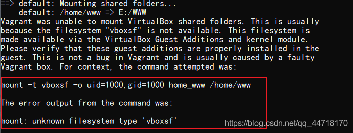
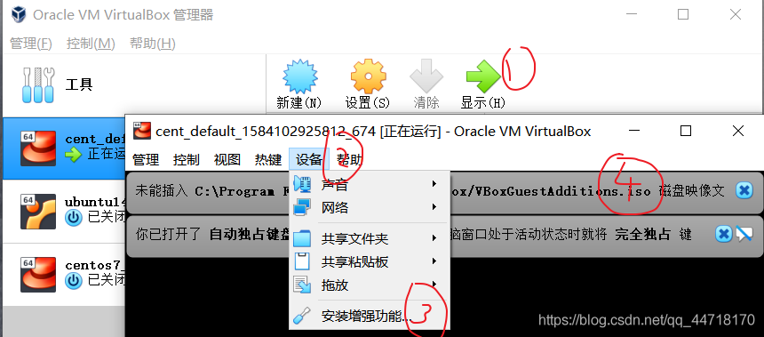
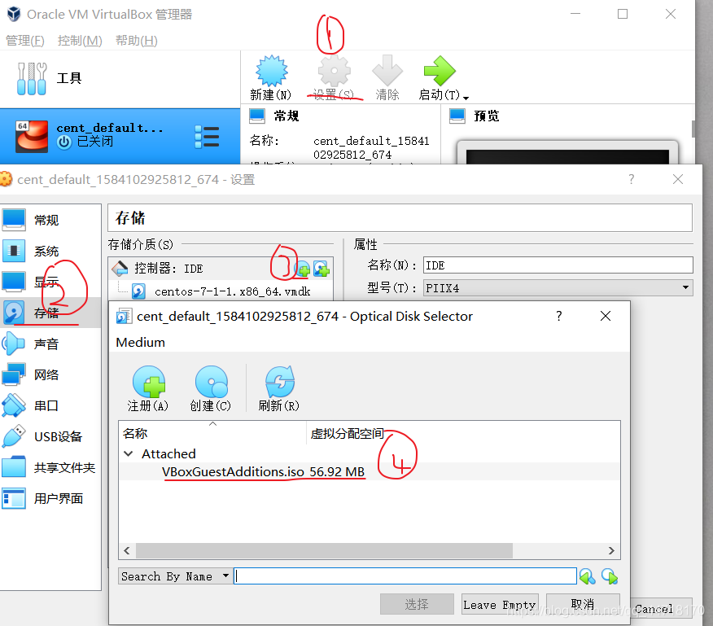
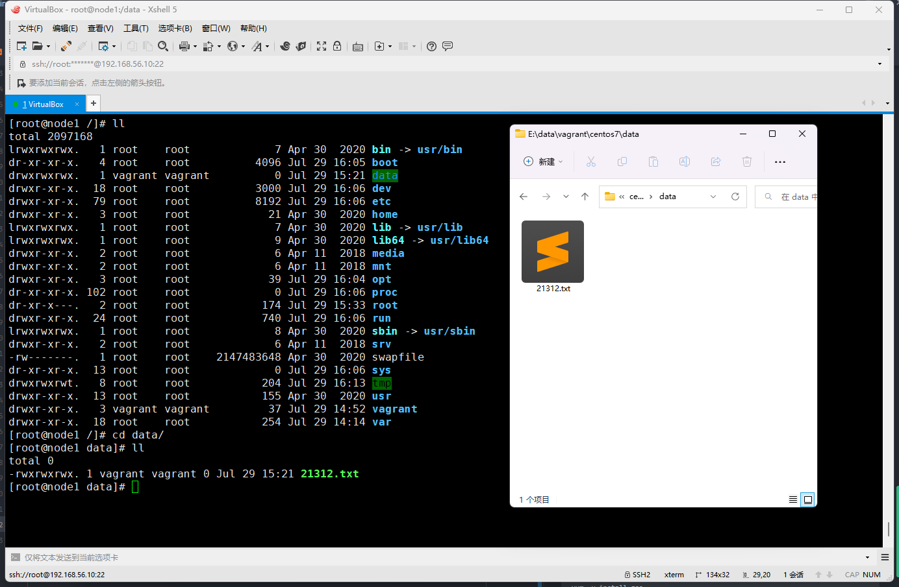

# Vagrant

> Ruby工具
Vagrant是一个基于Ruby的工具，用于创建和部署虚拟化开发环境。它 使用Oracle的开源VirtualBox虚拟化系统，使用 Chef创建自动化虚拟环境。

[官网](https://www.vagrantup.com/) https://www.vagrantup.com/

### Mac

```shell
brew install vagrant
```
安装完成
```shell
Pro ~ % vagrant version
Installed Version: 2.2.19
Latest Version: 2.2.19
```
初始化vagrant镜像环境
命令行方法
```shell
vagrant init centos/7
```

Vagrantfile
```shell
# -*- mode: ruby -*-
# vi: set ft=ruby :
ENV["LC_ALL"] = "en_US.UTF-8"
#指定vm的语言环境，缺省地，会继承host的locale配置
# All Vagrant configuration is done below. The "2" in Vagrant.configure
# configures the configuration version (we support older styles for
# backwards compatibility). Please don't change it unless you know what
# you're doing.
Vagrant.configure("2") do |config|
  # The most common configuration options are documented and commented below.
  # For a complete reference, please see the online documentation at
  # https://docs.vagrantup.com.

  # Every Vagrant development environment requires a box. You can search for
  # boxes at https://vagrantcloud.com/search.
  config.vm.box = "centos7"
  config.vm.hostname = "node1"

  # The url from where the 'config.vm.box' box will be fetched if it
  # doesn't already exist on the user's system.
  config.vm.box_url = "https://mirrors.ustc.edu.cn/centos-cloud/centos/7/vagrant/x86_64/images/CentOS-7.box"

  # Create a forwarded port mapping which allows access to a specific port
  # within the machine from a port on the host machine. In the example below,
  # accessing "localhost:8080" will access port 80 on the guest machine.
  # NOTE: This will enable public access to the opened port
  # config.vm.network "forwarded_port", guest: 80, host: 8080

  # Create a forwarded port mapping which allows access to a specific port
  # within the machine from a port on the host machine and only allow access
  # via 127.0.0.1 to disable public access
  # config.vm.network "forwarded_port", guest: 80, host: 8080, host_ip: "127.0.0.1"

  # Create a private network, which allows host-only access to the machine
  # using a specific IP.
  config.vm.network "private_network", ip: "192.168.56.10"

  # Create a public network, which generally matched to bridged network.
  # Bridged networks make the machine appear as another physical device on
  # your network.
  # config.vm.network "public_network",ip: "172.20.0.0"

  # Share an additional folder to the guest VM. The first argument is
  # the path on the host to the actual folder. The second argument is
  # the path on the guest to mount the folder. And the optional third
  # argument is a set of non-required options.
  # config.vm.synced_folder "/Users/zhangbao/data/vagrant/data/centos7/data", "/vagrant_data"

  # Provider-specific configuration so you can fine-tune various
  # backing providers for Vagrant. These expose provider-specific options.
  # Example for VirtualBox:
  #
  config.vm.provider "virtualbox" do |vb|
    vb.name = "centos7"
    #指定vm-name，也就是virtualbox管理控制台中的虚机名称。如果不指定该选项会生成一个随机的名字，不容易区分。
    #   # Display the VirtualBox GUI when booting the machine
    vb.gui = true
  #
  #   # Customize the amount of memory on the VM:
    vb.memory = "4096"

    vb.cpus = 2
    #设置CPU个数
  end
  #
  # View the documentation for the provider you are using for more
  # information on available options.

  # Enable provisioning with a shell script. Additional provisioners such as
  # Ansible, Chef, Docker, Puppet and Salt are also available. Please see the
  # documentation for more information about their specific syntax and use.
  # config.vm.provision "shell", inline: <<-SHELL
  #   apt-get update
  #   apt-get install -y apache2
  # SHELL
end
```

unbuntu
```shell
Vagrant.configure("2") do |config|
  config.vm.synced_folder '.', '/vagrant', disabled: true
  config.vm.define "ub1404" do |ub1404|
    ub1404.vm.box = "./metasploitable3_unbuntu.vbox"
    ub1404.vm.hostname = "metasploitable3-ub1404"
    config.ssh.username = 'vagrant'
    config.ssh.password = 'vagrant'
 
    ub1404.vm.network "private_network", ip: '192.168.56.150'
 
    ub1404.vm.provider "virtualbox" do |v|
      v.name = "Metasploitable3-ub1404"
      v.memory = 2048
    end
  end
end
```

Vagrantfile方法

编写Vagrantfile
```text
Vagrant.configure("2") do |config|
  config.vm.box = "centos/7"
end
```

Vagrant镜像网址

[镜像网址](https://www.vagrantup.com/) https://app.vagrantup.com/boxes/search?page=1

启动虚拟机
```shell
vagrant up

vagrant ssh

vagrant reload
```

进入centos7 
```shell
# 修改root密码
sudo passwd root
# 更新yum
yum update -y
# 安装ifconfig
yum -y install net-tools
# 安装 vim
yum -y install vim
```
新centos7配置 root用户ssh登录
vi /etc/ssh/sshd_conf
```shell
# ssh 端口号
Port 22
# 允许root登录
PermitRootLogin yes
```

## Vagrant-共享文件夹共享(virtulbox模式共享报错解决)
虚拟机启动成功出现异常
```shell
# 末尾抛出一个 “vboxsf” 的异常
mount: unknown filesystem type ‘vboxsf’
```

输入命令关闭虚拟机
```shell
vagrant halt
```
查看磁盘镜像文件，这里显示未能插入VBoxGuestAdditions.iso镜像，关闭即可(PS:虚拟机是启动状态)


找到光驱并添加(PS:虚拟机是关闭状态)
> VB提供了一个增强工具的镜像
默认安装位置位于C:\Program Files\Oracle\VirtualBox\VBoxGuestAdditions.iso,选中添加



再次启动虚拟机
```shell
vagrant up
```
> 添加光驱之后进去之后重新使用vagrant up启动仍然报错
这个问题是Linux无法成功挂载光驱，解决办法是手动到Linux中挂载光驱，并安装增强里面的增强插件。

进入Linux挂载光驱，一步一步跟着命令来

```shell
vagrant ssh			 //进入虚拟机
su root   		    //切换至root用户，密码"vagrant"
yum -y update
yum -y install gcc
yum -y install kernel
yum -y install kernel-devel
mount /dev/cdrom /mnt
cd /mnt
./VBoxLinuxAdditions.run
```
重启虚拟机
```shell
vagrant reload
```
共享文件夹就ok了

