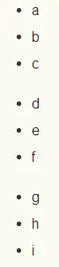
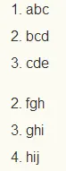
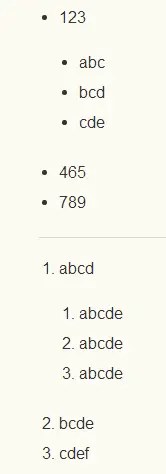
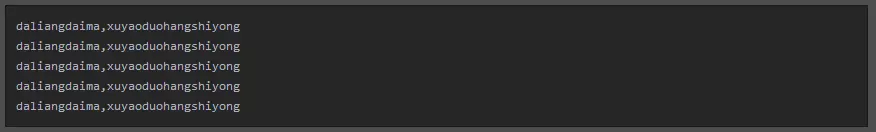
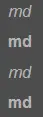
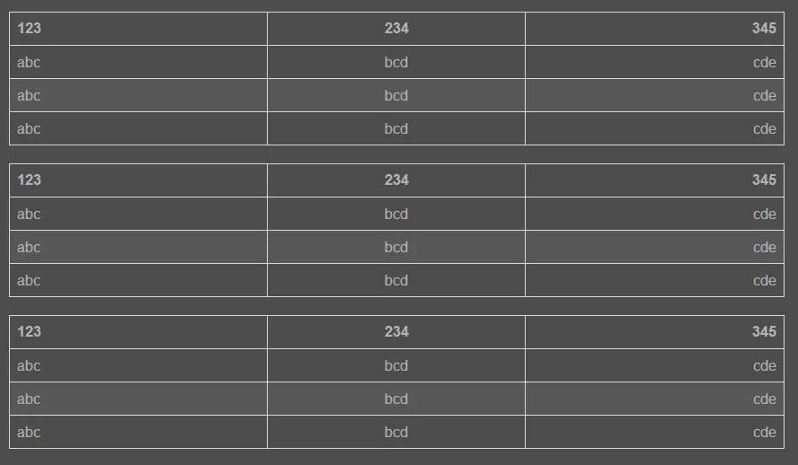

# Markdown

> Markdown 是一种轻量级标记语言，创始人为约翰·格鲁伯（John Gruber）。 它允许人们使用易读易写的纯文本格式编写文档，然后转换成有效的 XHTML（或者HTML）文档。这种语言吸收了很多在电子邮件中已有的纯文本标记的特性。

> 引用简书 .md即markdown文件的基本常用编写语法,是一种快速标记、快速排版语言，现在很多前段项目中的说明文件readme等都是用.md文件编写的

### 一、基本符号：* - +. >

基本上所有的markdown标记都是基于这四个符号或组合，需要注意的是，如果以基本符号开头的标记，注意基本符号后有一个用于分割标记符和内容的空格。

### 二、标题

1.前面带#号，后面带文字，分别表示h1-h6,只到h6，而且h1下面会有一条横线

```
# 一级标题
## 二级标题
### 三级标题
#### 四级标题
##### 五级标题
###### 六级标题
```

2.相当于标签闭合

```
# 一级标题 #
## 二级标题 ##
### 三级标题 ###
#### 四级标题 ####
##### 五级标题 #####
###### 六级标题 #####
```

效果如下：


https://upload-images.jianshu.io/upload_images/13623636-1be77fac16e71320.png?imageMogr2/auto-orient/strip|imageView2/2/format/webp)

### 三、列表

无序列表

```
//形式一
+ a
+ b
+ c
//形式二
- d
- e
- f
//形式三
* g
* h
* i
```

以上三种形式，效果其实都是一样的：



https://upload-images.jianshu.io/upload_images/13623636-eb8a09fef3e9241c.png?imageMogr2/auto-orient/strip|imageView2/2/format/webp)

有序列表

```
//正常形式
1. abc
2. bcd
3. cde
//错序效果
2. fgh
3. ghi
5. hij
```

效果图：



https://upload-images.jianshu.io/upload_images/13623636-9692dc2a7c7a8ecd.png?imageMogr2/auto-orient/strip|imageView2/2/format/webp)

> 如图，注意，数字后面的点只能是英文的点，有序列表的序号是根据第一行列表的数字顺序来的， 错序列表的序号本来是序号是乱的， 但是还是显示 2 3 5

嵌套列表

```
//无序列表嵌套
+ 123
    + abc
    + bcd
    + cde
+ 465
+ 789
//有序列表嵌套
1. abcd
    1. abcde
    2. abcde
    3. abcde
2. bcde
3. cdef
```

效果图：



https://upload-images.jianshu.io/upload_images/13623636-ea18c221bda4801d.png?imageMogr2/auto-orient/strip|imageView2/2/format/webp)

> 列表可以嵌套，使用时在嵌套列表前按 tab 或 空格 来缩进,去控制列表的层数

### 四、引用说明区块

对某个部分做的内容做一些说明或者引用某某的话等，可以用这个语法。

1.正常形式

```
> 引用内容、说明内容。在语句前面加一个 > ，注意是英文的那个右尖括号，注意空格，引用因为是一个区块，理论上是应该什么内容都可以放，比如说：标题，列表，引用等等。
```

效果图：


https://upload-images.jianshu.io/upload_images/13623636-1c272187ccfb1110.png?imageMogr2/auto-orient/strip|imageView2/2/format/webp)

2.嵌套区块 这里我只介绍一下我常用的方法，也是个人认为比较规范的一种方法，就是给区块的下一级区块多加一个右尖括号

```
> 一级引用
>> 二级引用
>>> 三级引用
>>>> 四级引用
>>>>> 五级引用
>>>>>> 六级引用
```

效果图：


https://upload-images.jianshu.io/upload_images/13623636-1aabce7718f76dab.png?imageMogr2/auto-orient/strip|imageView2/2/format/webp)

### 五、代码块

在发布一些技术文章会涉及展示代码的问题，这时候代码块就显得尤为重要。

1.少量代码，单行使用，直接用`包裹起来就行了

```
` shaoliangdaima,danhangshiyong `
```

效果图：


https://upload-images.jianshu.io/upload_images/13623636-ad3162fde43960f6.png?imageMogr2/auto-orient/strip|imageView2/2/format/webp)

单行代码块.png

2.大量代码，需要多行使用，用```包裹起来

```
    ```
        daliangdaima,xuyaoduohangshiyong
        daliangdaima,xuyaoduohangshiyong
        daliangdaima,xuyaoduohangshiyong
        daliangdaima,xuyaoduohangshiyong
        daliangdaima,xuyaoduohangshiyong
    ```
```

效果图：


https://upload-images.jianshu.io/upload_images/13623636-f36ccf1b4129df6b.png?imageMogr2/auto-orient/strip|imageView2/2/format/webp)

多行代码.png

### 六、链接

1.行内式 链接的文字放在[]中，链接地址放在随后的()中，链接也可以带title属性，链接地址后面空一格，然后用引号引起来

```
[简书](https://www.jianshu.com "创作你的创作"),
是一个创作社区,任何人均可以在其上进行创作。用户在简书上面可以方便的创作自己的作品,互相交流。
```

2.参数式 链接的文字放在[]中，链接地址放在随后的:后，链接地址后面空一格，然后用引号引起来

```
[简书]: https://www.jianshu.com "创作你的创作"
[简书]是一个创作社区,任何人均可以在其上进行创作。用户在简书上面可以方便的创作自己的作品,互相交流。
//参数定义的其他写法
[简书]: https://www.jianshu.com '创作你的创作'
[简书]: https://www.jianshu.com (创作你的创作)
[简书]: <https://www.jianshu.com> "创作你的创作"
```

以上两种方式其效果图都是一样的，如下：


https://upload-images.jianshu.io/upload_images/13623636-94e98682ec1d1e8c.png?imageMogr2/auto-orient/strip|imageView2/2/format/webp

链接.png

### 七、图片

1.行内式 和链接的形式差不多，图片的名字放在[]中，图片地址放在随后的()中，title属性（图片地址后面空一格，然后用引号引起来）,注意的是[]前要加上!

```

```

2.参数式 图片的文字放在[]中，图片地址放在随后的:后，title属性（图片地址后面空一格，然后用引号引起来）,注意引用图片的时候在[]前要加上!

```
[my-logo.png]: https://upload-images.jianshu.io/upload_images/13623636-6d878e3d3ef63825.png?imageMogr2/auto-orient/strip%7CimageView2/2/w/1240 "my-logo"
![my-logo.png]
//参数定义的其他写法
[my-logo.png]: https://upload-images.jianshu.io/upload_images/13623636-6d878e3d3ef63825.png?imageMogr2/auto-orient/strip%7CimageView2/2/w/1240 'my-logo'
[my-logo.png]: https://upload-images.jianshu.io/upload_images/13623636-6d878e3d3ef63825.png?imageMogr2/auto-orient/strip%7CimageView2/2/w/1240 (my-logo)
[my-logo.png]: <https://upload-images.jianshu.io/upload_images/13623636-6d878e3d3ef63825.png?imageMogr2/auto-orient/strip%7CimageView2/2/w/1240> "my-logo"
```

以上两种方式其效果图都是一样的，如下：

(https://upload-images.jianshu.io/upload_images/13623636-6d878e3d3ef63825.png?imageMogr2/auto-orient/strip|imageView2/2/format/webp)
my-logo.png

### 八、分割线

分割线可以由* - _（星号，减号，底线）这3个符号的至少3个符号表示，注意至少要3个，且不需要连续，有空格也可以

```
---
- - -
------
***
* * *
******
___
_ _ _
______
```

以上代码的效果图均为：

(https://upload-images.jianshu.io/upload_images/13623636-d714148b4379f47b.png?imageMogr2/auto-orient/strip|imageView2/2/format/webp)
分割线.png

### 九、其他

1.强调字体 一个星号或者是一个下划线包起来，会转换为`<em>`倾斜，如果是2个，会转换为`<strong>`加粗

```
*md*  
**md**
_md_   
 __md__
```

效果图：



https://upload-images.jianshu.io/upload_images/13623636-c0fa033d2f13d33f.png?imageMogr2/auto-orient/strip|imageView2/2/w/43/format/webp)

强调字体.png 2.转义 基本上和js转义一样,\加需要转义的字符

```
\\
\*
\+
\-
\`
\_
```

3.删除线 用~~把需要显示删除线的字符包裹起来

```
~~删除~~
```

效果图：


https://upload-images.jianshu.io/upload_images/13623636-609dee16fabaddd0.png?imageMogr2/auto-orient/strip|imageView2/2/format/webp

删除线.png

### 十、表格

```
//例子一
|123|234|345|
|:-|:-:|-:|
|abc|bcd|cde|
|abc|bcd|cde|
|abc|bcd|cde|
//例子二
|123|234|345|
|:---|:---:|---:|
|abc|bcd|cde|
|abc|bcd|cde|
|abc|bcd|cde|
//例子三
123|234|345
:-|:-:|-:
abc|bcd|cde
abc|bcd|cde
abc|bcd|cde
```

上面三个例子的效果一样，由此可得：

1. 表格的格式不一定要对的非常起，但是为了良好的变成风格，尽量对齐是最好的
2. 分割线后面的冒号表示对齐方式，写在左边表示左对齐，右边为右对齐，两边都写表示居中

效果图如下：

(https://upload-images.jianshu.io/upload_images/13623636-e12253979ce0ab66.png?imageMogr2/auto-orient/strip|imageView2/2/w/888/format/webp)

