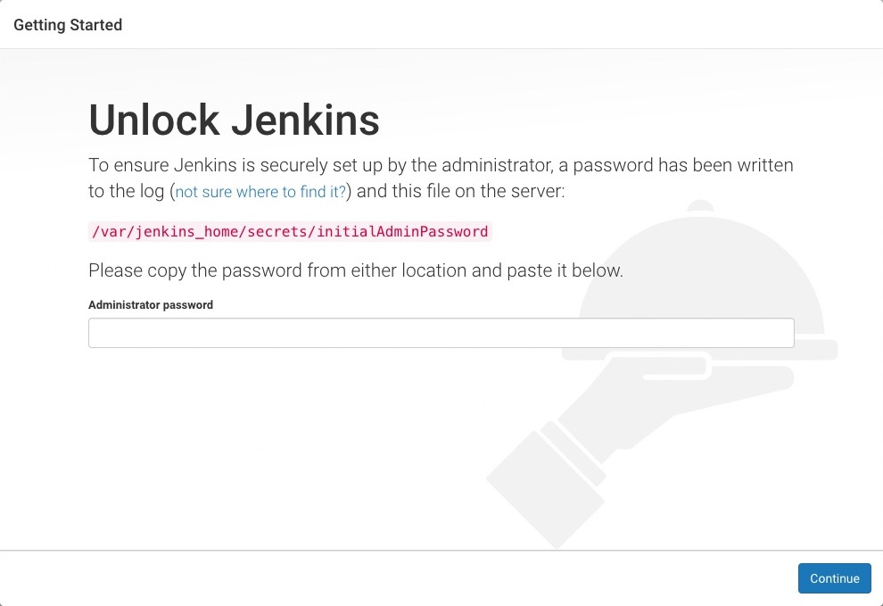
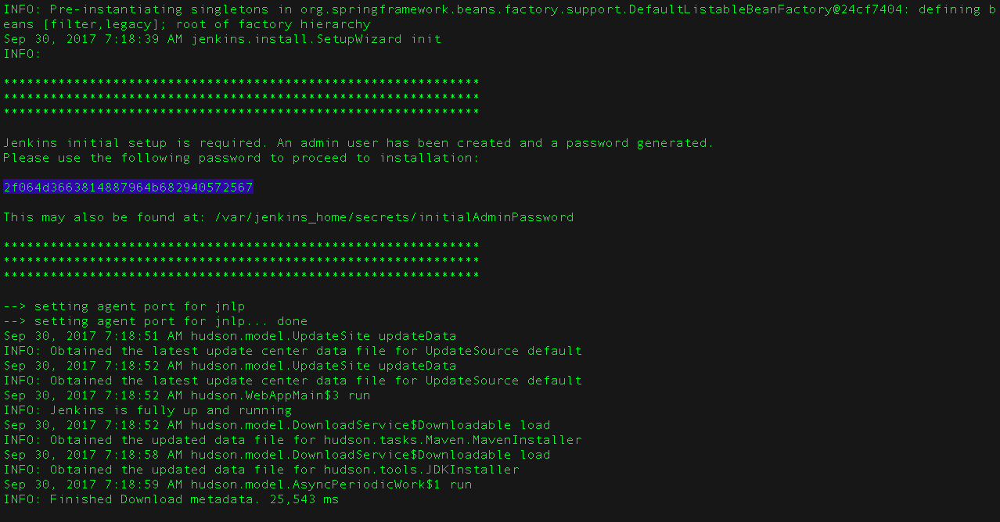

# jenkins

## 介绍

## windows docker 安装
```shell
docker run -u root -d --net prod-network --ip 172.18.0.5 --name jenkins -p 28080:8080 -p 50000:50000 -v E:\data\apps\jenkins/data:/var/jenkins_home -v /var/run/docker.sock:/var/run/docker.sock  jenkinsci/blueocean
```

## mac docker 安装
```shell
docker run -u root -d --net prod-network --ip 172.18.0.5 --name jenkins -p 28080:8080 -p 50000:50000 -v $PWD/data:/var/jenkins_home -v /var/run/docker.sock:/var/run/docker.sock jenkinsci/blueocean 
```

## 登录jenkins
当您第一次访问新的Jenkins实例时，系统会要求您使用自动生成的密码对其进行解锁。

浏览到 http://localhost:8080（或安装时为Jenkins配置的任何端口），并等待 解锁 Jenkins 页面出现。

从Jenkins控制台日志输出中，复制自动生成的字母数字密码（在两组星号之间）。


在 解锁Jenkins 页面上，将此 密码 粘贴到管理员密码字段中，然后单击 继续 。

### maven 构建 java项目

https://www.jenkins.io/zh/doc/tutorials/build-a-java-app-with-maven/