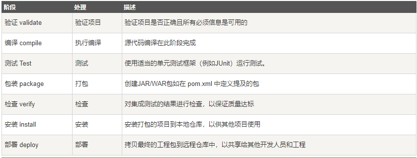

# maven

## Maven 标准项目目录详细说明

|                目录                |                                    作用                                    |
| :---------------------------------: | :------------------------------------------------------------------------: |
|             ${basedir}s             |                         存放 pom.xml 和所有子目录                         |
|      ${basedir}/src/main/javas      |                        项目的 java 源代码所在的目录                        |
|   ${basedir}/src/main/resourcess   |                项目的资源文件所在的目录，例如：propert文件                |
|      ${basedir}/src/test/javas      |                    测试代码所在的目录，例如：JUnit 代码                    |
|   ${basedir}/src/test/resourcess   |                        测试相关的资源文件所在的目录                        |
| ${basedir}/src/main/webapp/WEB-INFs | web 应用文件目录，web 项目的信息，比如存放 web.xml、本地图片、jsp 视图页面 |
|         ${basedir}/targets         |                                打包输出目录                                |
|     ${basedir}/target/classess     |                                编译输出目录                                |
|   ${basedir}/target/test-classes   |                              测试编译输出目录                              |

## Maven 工程目录


## Maven 构件特性

|    -    | 编译期 | 测试期 | 运行期 |                                  说明                                  |
| :------: | :----: | :----: | :----: | :--------------------------------------------------------------------: |
| compile |   √   |   √   |   √   |                                默认范围                                |
| provided |   √   |   √   |        |               如 servlet-api.jar，运行期由web容器提供。               |
| runtime |        |   √   |   √   |                          编译期无需直接引用。                          |
|   test   |        |   √   |        |                             如junit.jar。                             |
|  system  |   √   |   √   |        | 必须通过  元素，显示指定依赖文件的路径，与本地系统相关联，可移植性差。 |
|  import  |        |        |        |                   表示继承父POM.XML中的依赖范围设置                   |

### compile

编译依赖范围（默认），使用此依赖范围对于编译、测试、运行三种都有效，即在编译、测试和运行的时候都要使用该依赖 Jar 包。

### test

测试依赖范围，从字面意思就可以知道此依赖范围只能用于测试，而在编译和运行项目时无法使用此类依赖，典型的是 JUnit，它只用于编译测试代码和运行测试代码的时候才需要。

### provided

此依赖范围，对于编译和测试有效，而对运行时无效。比如 servlet-api.jar 在 Tomcat 中已经提供了，我们只需要的是编译期提供而已。

### runtime

运行时依赖范围，对于测试和运行有效，但是在编译主代码时无效，典型的就是JDBC驱动实现。

### system

系统依赖范围，使用 system 范围的依赖时必须通过 systemPath 元素显示地指定依赖文件的路径，不依赖 Maven 仓库解析，所以可能会造成建构的不可移植。

> validate： 用于验证项目的有效性和其项目所需要的内容是否具备
> initialize：初始化操作，比如创建一些构建所需要的目录等。
> generate-sources：用于生成一些源代码，这些源代码在compile phase中需要使用到
> process-sources：对源代码进行一些操作，例如过滤一些源代码
> generate-resources：生成资源文件（这些文件将被包含在最后的输入文件中）
> process-resources：对资源文件进行处理
> compile：对源代码进行编译
> process-classes：对编译生成的文件进行处理
> generate-test-sources：生成测试用的源代码
> process-test-sources：对生成的测试源代码进行处理
> generate-test-resources：生成测试用的资源文件
> process-test-resources：对测试用的资源文件进行处理
> test-compile：对测试用的源代码进行编译
> process-test-classes：对测试源代码编译后的文件进行处理
> test：进行单元测试
> prepare-package：打包前置操作
> package：打包
> pre-integration-test：集成测试前置操作
> integration-test：集成测试
> post-integration-test：集成测试后置操作
> install：将打包产物安装到本地maven仓库
> deploy：将打包产物安装到远程仓库

## Maven生命周期

Maven 有以下三个标准的生命周期（注意，此处不是指的软件生命周期，后者是软件的产生直到报废或停止使用的生命周期）：

1、clean：项目清理。主要用于清理上一次构建产生的文件，可以理解为删除 target 目录。

2、default(或 build)：项目构建。主要阶段包含：

> process-resources 默认处理src/test/resources/下的文件，将其输出到测试的classpath目录中
> compile 编译src/main/java下的java文件，产生对应的class
> process-test-resources 默认处理src/test/resources/下的文件，将其输出到测试的classpath目录中
> test-compile 编译src/test/java下的java文件，产生对应的class
> test 运行测试用例
> package 打包构件，即生成对应的jar、war等
> install将构件部署到本地仓库
> deploy 部署构件到远程仓库

3、site：项目站点文档创建。
每个生命周期中都包含着一系列的阶段（phase）。这些 phase 就相当于 Maven 提供的统一的接口，这些 phase 的实现由 Maven 的插件来完成。



## Maven快照

在 Maven 仓库中，一般情况下，一个仓库会分为 public(Release)仓和 SNAPSHOT 仓，前者存放正式版本，后者存放快照版本。如果在项目配置文件中 pom.xml 指定的版本号带有"-SNAPSHOT"后缀，比如版本号为"JUnit-4.10-SNAPSHOT"，那么打出的包就是一个快照版本。
在配置 Maven 的 Repository 的时候中有个配置项，可以配置对于 SNAPSHOT 版本向远程仓库中查找的频率。频率共有四种，分别是 always、daily、interval、never。当本地仓库中存在需要的依赖项目时，always是每次都去远程仓库查看是否有更新，daily是只在第一次的时候查看是否有更新，当天的其它时候则不会查看；interval允许设置一个分钟为单位的间隔时间，在这个间隔时间内只会去远程仓库中查找一次，never是不会去远程仓库中查找（这种就和正式版本的行为一样了）。
Maven版本的配置方式为：

```
<id>myRepository</id>
    <url>...</url>
    <snapshots>
        <enabled>true</enabled> 
        <!-默认值->
        <updatePolicy>daily</updatePolicy>
    </snapshots>
</repository>
```


